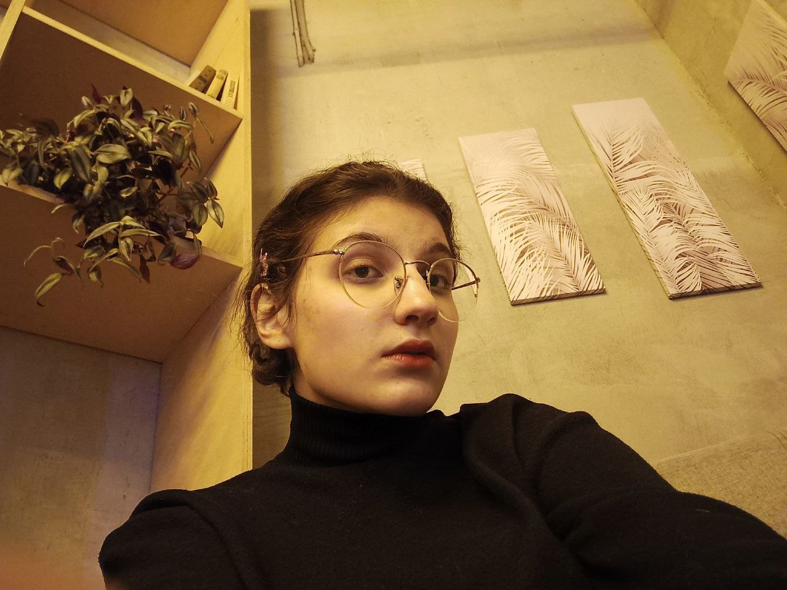
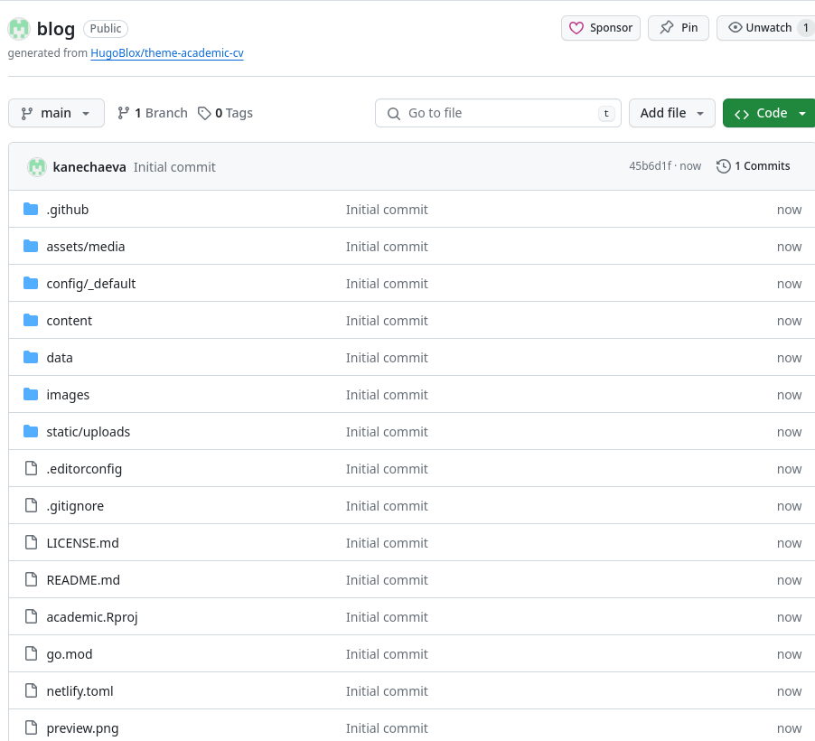
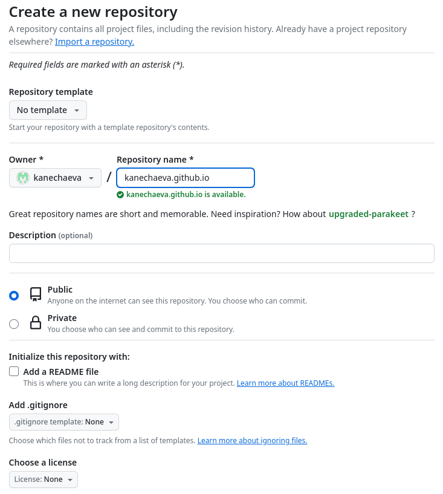
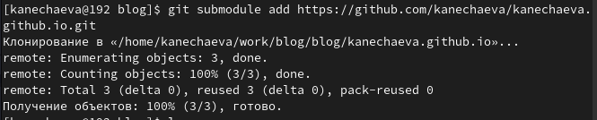

---
## Front matter
lang: ru-RU
title: Индивидуальный проект
subtitle: Первый этап
author:
  - Нечаева К.А.
institute:
  - Российский университет дружбы народов, Москва, Россия
date: 02 марта 2024

## i18n babel
babel-lang: russian
babel-otherlangs: english

## Formatting pdf
toc: false
toc-title: Содержание
slide_level: 2
aspectratio: 169
section-titles: true
theme: metropolis
header-includes:
 - \metroset{progressbar=frametitle,sectionpage=progressbar,numbering=fraction}
 - '\makeatletter'
 - '\beamer@ignorenonframefalse'
 - '\makeatother'
---

# Информация

## Докладчик

:::::::::::::: {.columns align=center}
::: {.column width="70%"}

  * Нечаева Кира Андреевна
  * Cтудентка
  * Российский университет дружбы народов
  * [1132236031@pfur.ru](mailto:1132236031@pfur.ru)
 

:::
::: {.column width="30%"}



:::
::::::::::::::

# Вводная часть

## Актуальность

- Hugo является самой удобной платформой для создания сайтов.
- Важно уметь создать свой сайт, чтобы сообщить о своих достижениях.
- Необходимо уметь реализовывать и визуализировать свои задумки для зрителей.

## Объект и предмет исследования

- Hugo
- Работа на Github

## Цели и задачи

- Создание основных элементов для сайта на hugo
- Первоначальная настройка сайта

## Материалы и методы

- Система Git
- Консоль (терминал) Linux

# Ход работы по проекту

## Установка необходимого ПО
- Для начала я устанавливаю go, так как на нем написан hugo, и, соответственно, без go ничего работать не будет.
- После этого я скачала с официального репозитория hugo архив с последней версией Hugo Extended и затем в терминале разархивировала его и удалила лишние файлы.

:::::::::::::: {.columns align=center}
::: {.column width="30%"}

 

:::
::: {.column width="30%"}


:::
::: {.column width="30%"}


::::::::::::::


## Структура сайта
- Теперь я захожу на репозиторий hugo, откуда я возьму шаблон для своего репозитория сайта.
- Там же я создаю свой репозиторий, нажав на кнопку "Use this template".
- Теперь я клонирую репозиторий к себе на компьютер. 

:::::::::::::: {.columns align=center}
::: {.column width="20%"}

 

:::
::: {.column width="20%"}



:::
::: {.column width="20%"}


::::::::::::::


## Настройка сайта
- Затем на Github я создаю новый репозиторий, где также будет храниться работа по моему сайту. Затем точно так же, каки blog его клонирую.
- После этого я добавляю главную ветку и создаю файл, чтобы мне было удобнее копировать ссылку для следующего шага. 
- И сейчас мне нужно сделать репозиторий kanechaeva.github.io подмодулем public в папке блога.

:::::::::::::: {.columns align=center}
::: {.column width="40%"}

 

:::
::: {.column width="40%"}



:::
::::::::::::::


## Публикация сайта
- После этого с помощью команды hugo я фиксирую изменения на сайте.
- И наконец отправляю все изменения на Github.

:::::::::::::: {.columns align=center}
::: {.column width="40%"}

 

:::
::: {.column width="40%"}


:::
::::::::::::::


# Вывод
При выполнении данного этапа проекта я создала основныe элементы для сайта на hugo.

# Список литературы{.unnumbered}

::: {https://yamadharma.github.io/ru/post/2022/04/12/creating-hugo-site/}
:::


## Код для формата `pdf`

```yaml
slide_level: 2
aspectratio: 169
section-titles: true
theme: metropolis
```


## Код для формата `html`


```make
REVEALJS_THEME = beige 
```


