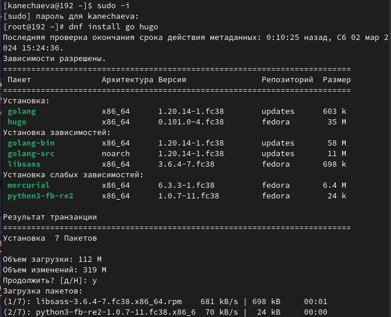
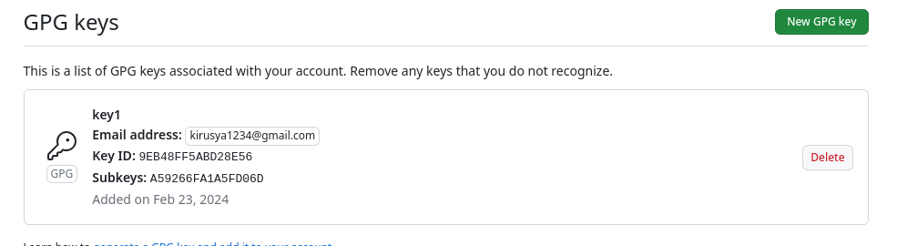

---
## Front matter
lang: ru-RU
title: Лабораторная работа №2
subtitle: Первичная настройка Git
author:
  - Нечаева К.А.
institute:
  - Российский университет дружбы народов, Москва, Россия
date: 01 марта 2024

## i18n babel
babel-lang: russian
babel-otherlangs: english

## Formatting pdf
toc: false
toc-title: Содержание
slide_level: 2
aspectratio: 169
section-titles: true
theme: metropolis
header-includes:
 - \metroset{progressbar=frametitle,sectionpage=progressbar,numbering=fraction}
 - '\makeatletter'
 - '\beamer@ignorenonframefalse'
 - '\makeatother'
---

# Информация

## Докладчик

:::::::::::::: {.columns align=center}
::: {.column width="70%"}

  * Нечаева Кира Андреевна
  * студентка
  * Российский университет дружбы народов
  * [1132236031@pfur.ru](mailto:1132236031@pfur.ru)
 

:::
::: {.column width="30%"}


:::
::::::::::::::

# Вводная часть

## Актуальность

- Важно уметь работать с системой Git
- Необходимо уметь создать репозиторий для дальнейшей работы
- Желательно уметь клонировать данные с компьютера на сайт автоматически 

## Объект и предмет исследования

- Система Git
- Работа на Github

## Цели и задачи

- Изучение идеологии и применение средств контроля версий
- Приобрести практические навыки по работе с системой git.

## Материалы и методы

- Система Git
- Консоль (терминал) Linux

# Ход лабораторной работы

## 1. Установка git
Поскольку у меня уже установлен Github, я могу пропустить этот шаг, однако я покажу, что Git у меня есть. 



## 2. Базовая настройка git
Сначала необходимо сделать предварительную конфигурацию git.
Настраиваю utf-8 в выводе сообщений git для верного отображения символов.
Задаю имя начальной ветки “master”.
Задаю параметры autocrlf и safecrlf.


## 3. Создание SSH ключа
Для последующей идентификации пользователя на сервере репозиториев генерирую пару SSH ключей: по алгоритму rsa и по алгоритму ed25519.

:::::::::::::: {.columns align=center}
::: {.column width="40%"}

 

:::
::: {.column width="40%"}


:::
::::::::::::::


## 4. Создание GPG ключа
Затем генерирую gpg ключ. Из предложенных опций выбираю тип RSA and RSA, размер 4096 и безвременный срок действия. Затем ввожу некоторую личную информацию и придумываю пароль. 


Теперь я вывожу список ключей и копирую отпечаток приватного ключа в буфер обмена.

Захожу на сайт GitHub. Выбираю в меню  “Настройки”, затем “SSH and GPG keys”. Нажимаю кнопку «New GPG key».  Вставляю скопированный ключ в поле «Key». Нажимаю «Add GPG-key», чтобы завершить добавление ключа. 


## 5. Настройка gh 
Используя введёный email, указываю Git применять его при подписи коммитов. 
Теперь необходимо авторизоваться. Утилита задаст несколько наводящих вопросов, после чего я авторизовываюсь через браузер. 


## 6. Создание рабочего пространства на основе шаблона
Репозиторий на основе шаблона создаю через web-интерфейс github. Перехожу на станицу репозитория с шаблоном курса https://github.com/yamadharma/course-directory-student-template. Далее выбераю Use this template.

## 7. Сознание репозитория курса на основе шаблона
Теперь создаю рабочее пространство. Я делаю это по типологии для 2022-2023 года. 

:::::::::::::: {.columns align=center}
::: {.column width="50%"}

 

:::
::: {.column width="50%"}


:::
::::::::::::::


## 8. Настройка каталога курса 
Перехожу в каталог курса, удалияю лишние файлы и создаю необходимые каталоги. После чего отправляю файлы на сервер. 

:::::::::::::: {.columns align=center}
::: {.column width="30%"}

 

:::
::: {.column width="30%"}


:::
::: {.column width="30%"}


::::::::::::::


# Результаты

- Я изучила идеологию и применение средств контроля версий. 
- Я приобрела практические навыки по работе с системой git.

# Список литературы{.unnumbered}

::: {https://esystem.rudn.ru/mod/page/view.php?id=1098790}
:::


## Код для формата `pdf`

```yaml
slide_level: 2
aspectratio: 169
section-titles: true
theme: metropolis
```


## Код для формата `html`


```make
REVEALJS_THEME = beige 
```


