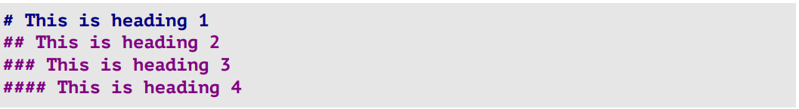
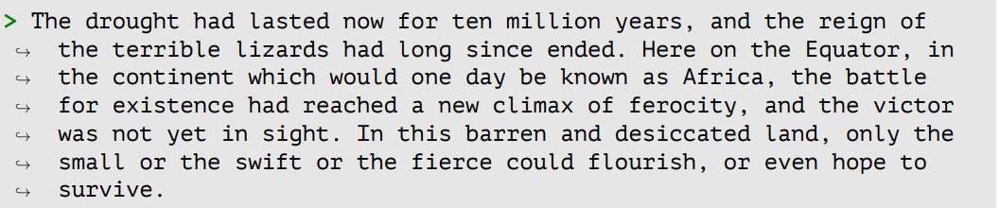
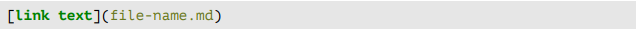
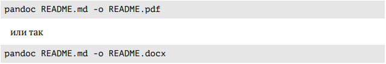
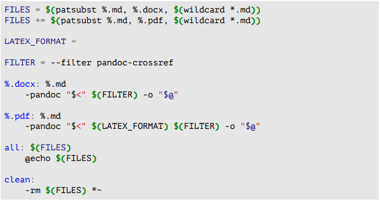

---
## Front matter
lang: ru-RU
title: Лабораторная работа №3
subtitle: Markdown
author:
  - Нечаева К.А.
institute:
  - Российский университет дружбы народов, Москва, Россия
date: 01 марта 2024

## i18n babel
babel-lang: russian
babel-otherlangs: english

## Formatting pdf
toc: false
toc-title: Содержание
slide_level: 2
aspectratio: 169
section-titles: true
theme: metropolis
header-includes:
 - \metroset{progressbar=frametitle,sectionpage=progressbar,numbering=fraction}
 - '\makeatletter'
 - '\beamer@ignorenonframefalse'
 - '\makeatother'
---

# Информация

## Докладчик

:::::::::::::: {.columns align=center}
::: {.column width="70%"}

  * Нечаева Кира Андреевна
  * студентка
  * Российский университет дружбы народов
  * [1132236031@pfur.ru](mailto:1132236031@pfur.ru)
 

:::
::: {.column width="30%"}


:::
::::::::::::::

# Вводная часть

## Актуальность

- Важно уметь работать с языком разметки Markdown
- Необходимо уметь использовать функции данного языка для дальнейшего облегчения работы

## Объект и предмет исследования

- Язык разметки Markdown

## Цели и задачи

- Научиться оформлять отчёты с помощью легковесного языка разметки Markdown.

## Материалы и методы

- Легковесный язык разметки Markdown
- Консоль (терминал) Linux

# Ход лабораторной работы

## Базовые сведения о Markdown

Чтобы создать заголовок, нужно использовать знак ( # ).


## Оформление текста 

Чтобы задать для текста полужирное начертание, следует заключить его в двойные звездочки:

**кошечка**

Чтобы задать для текста курсивное начертание, необходимо поставить перед текстом и после одинарные звездочки:

*котик*

Для задания для текста полужирного и курсивного начертания, он заключается в тройные звездочки:

***котенок***

## Цитаты и упорядоченные списки
Блоки цитирования создаются с помощью символа >:



Упорядоченный список можно отформатировать с помощью соответствующих цифр. Чтобы вложить один список в другой, нужно добавить отступ (с помощью Tab) для элементов дочернего списка.

## Списки
Неупорядоченный (маркированный) список можно отформатировать с помощью звездочек или тире. А чтобы вложить один список в другой, нужно добавить отступ (с помощью Tab) для элементов дочернего списка:

- котик
  - кошечка
- песик
  - котенок
    - собачка

 или 

* мур
* мяу
* гав

## Ссылки и части кода

Синтаксис Markdown для встроенной ссылки состоит из части [link text], представляющей текст гиперссылки, и части (file-name.md) – URL-адреса или имени файла, на который дается ссылка.


Markdown поддерживает как встраивание фрагментов кода в предложение, так и их размещение между предложениями в виде отдельных огражденных блоков. Огражденные  блоки кода — это простой способ выделить синтаксис для фрагментов кода.


## Обработка файлов в формате Markdown
Для обработки файлов в формате Markdown удобно использовать Pandoc Конкретно, понадобятся программы pandoc, pandoc-citeproc и pandoc-crossref.
Преобразовать файл README.md можно так:



## Makefile

Кроме того можно использовать различные Makefile, например, такой:



# Результаты

- Я научилась оформлять отчёты с помощью легковесного языка разметки Markdown.


# Список литературы{.unnumbered}

::: {https://esystem.rudn.ru/pluginfile.php/2288079/mod_resource/content/3/003-lab_markdown.pdf}
:::


## Код для формата `pdf`

```yaml
slide_level: 2
aspectratio: 169
section-titles: true
theme: metropolis
```


## Код для формата `html`


```make
REVEALJS_THEME = beige 
```


