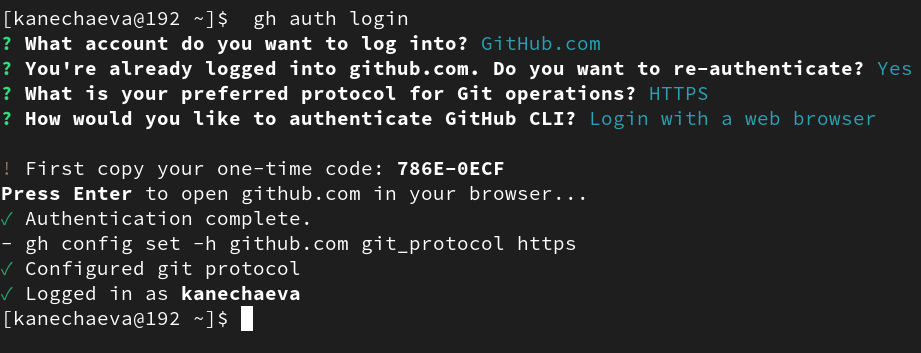

---
## Front matter
title: "Отчёт по лабораторной работе №3"
subtitle: "Дисциплина: Операционные сиситемы"
author: "Нечаева Кира Андреевна"

## Generic otions
lang: ru-RU
toc-title: "Содержание"

## Bibliography
bibliography: bib/cite.bib
csl: pandoc/csl/gost-r-7-0-5-2008-numeric.csl

## Pdf output format
toc: true # Table of contents
toc-depth: 2
lof: true # List of figures
lot: true # List of tables
fontsize: 12pt
linestretch: 1.5
papersize: a4
documentclass: scrreprt
## I18n polyglossia
polyglossia-lang:
  name: russian
  options:
	- spelling=modern
	- babelshorthands=true
polyglossia-otherlangs:
  name: english
## I18n babel
babel-lang: russian
babel-otherlangs: english
## Fonts
mainfont: PT Serif
romanfont: PT Serif
sansfont: PT Sans
monofont: PT Mono
mainfontoptions: Ligatures=TeX
romanfontoptions: Ligatures=TeX
sansfontoptions: Ligatures=TeX,Scale=MatchLowercase
monofontoptions: Scale=MatchLowercase,Scale=0.9
## Biblatex
biblatex: true
biblio-style: "gost-numeric"
biblatexoptions:
  - parentracker=true
  - backend=biber
  - hyperref=auto
  - language=auto
  - autolang=other*
  - citestyle=gost-numeric
## Pandoc-crossref LaTeX customization
figureTitle: "Рис."
tableTitle: "Таблица"
listingTitle: "Листинг"
lofTitle: "Список иллюстраций"
lotTitle: "Список таблиц"
lolTitle: "Листинги"
## Misc options
indent: true
header-includes:
  - \usepackage{indentfirst}
  - \usepackage{float} # keep figures where there are in the text
  - \floatplacement{figure}{H} # keep figures where there are in the text
---

# **1 Цель работы**

Целью работы является изучить идеологию и применение средств контроля версий. Приобрести практические навыки по работе с системой git.

# **2 Задание**
    1. Установка git
    2. Базовая настройка git
    3. Создание SSH ключа
    4. Создание GPG ключа
    5. Настройка git
    6. Создание рабочего пространства на основе шаблона
    7. Создание репозитория курса на основе шаблона
    8. Настройка каталога курса

# **3 Теоретическое введение**
Системы контроля версий (Version Control System, VCS) применяются при работе нескольких человек над одним проектом. Обычно основное дерево проекта хранится в локальном или удалённом репозитории, к которому настроен доступ для участников проекта. При внесении изменений в содержание проекта система контроля версий позволяет их фиксировать, совмещать изменения, произведённые разными участниками проекта, производить откат к любой более ранней версии проекта, если это требуется. 
В классических системах контроля версий используется централизованная модель, предполагающая наличие единого репозитория для хранения файлов. Выполнение большинства функций по управлению версиями осуществляется специальным сервером. Участник проекта (пользователь) перед началом работы посредством определённых команд получает нужную ему версию файлов. После внесения изменений, пользователь размещает новую версию в хранилище. При этом предыдущие версии не удаляются из центрального хранилища и к ним можно вернуться в любой момент. Сервер может сохранять не полную версию изменённых файлов, а производить так называемую дельта-компрессию — сохранять только изменения между последовательными версиями, что позволяет уменьшить объём хранимых данных. 
Системы контроля версий поддерживают возможность отслеживания и разрешения конфликтов, которые могут возникнуть при работе нескольких человек над одним файлом. Можно объединить (слить) изменения, сделанные разными участниками (автоматически или вручную), вручную выбрать нужную версию, отменить изменения вовсе или заблокировать файлы для изменения. В зависимости от настроек блокировка не позволяет другим пользователям получить рабочую копию или препятствует изменению рабочей копии файла средствами файловой системы ОС, обеспечивая таким образом, привилегированный доступ только одному пользователю, работающему с файлом. 
Системы контроля версий также могут обеспечивать дополнительные, более гибкие функциональные возможности. Например, они могут поддерживать работу с несколькими версиями одного файла, сохраняя общую историю изменений до точки ветвления версий и собственные истории изменений каждой ветви. Кроме того, обычно доступна информация о том, кто из участников, когда и какие изменения вносил. Обычно такого рода информация хранится в журнале изменений, доступ к которому можно ограничить. 
В отличие от классических, в распределённых системах контроля версий центральный репозиторий не является обязательным. 
Среди классических VCS наиболее известны CVS, Subversion, а среди распределённых — Git, Bazaar, Mercurial. Принципы их работы схожи, отличаются они в основном синтаксисом используемых в работе команд.

# **4 Выолнение лабораторной работы**

## **1. Установка git**
Поскольку у меня уже установлен Github, я могу пропустить этот шаг, однако я покажу, что Git у меня есть. (рис. [-@fig:001])
{#fig:001 width=70%}

## **2. Базовая настройка git**
Сначала сделаю предварительную конфигурацию git. Открываю терминал и ввожу команды:
git config --global user.name "<kanechaeva>”
git config --global user.email "<kirusya1234@gmail.com>”
указав свои имя и email.
Настраиваю utf-8 в выводе сообщений git для верного отображения символов.
Задаю имя начальной ветки “master”.
Задаю параметр autocrlf со значением input.
Задаю параметр safecrlf со значением warn, так Git будет проверять преобразование на обратимость. 
Все действия отображены в рис.[-@fig:002]
{#fig:002 width=70%}

## **3. Создание SSH ключа**
Для последующей идентификации пользователя на сервере репозиториев генерирую пару SSH ключей: по алгоритму rsa (рис. [-@fig:003]) и по алгоритму ed25519 (рис. [-@fig:004]).
{#fig:003 width=70%}
{#fig:004 width=70%}

## **4. Создание GPG ключа**
Затем генерирую gpg ключ. Из предложенных опций выбираю тип RSA and RSA, размер 4096 и безвременный срок действия. Затем ввожу некоторую личную информацию и придумываю пароль. (рис. [-@fig:005])
{#fig:005 width=70%}

Теперь я вывожу список ключей и копирую отпечаток приватного ключа в буфер обмена. (рис. [-@fig:006])
{#fig:006 width=70%}

Захожу на сайт GitHub. Выбираю в меню  “Настройки”, затем “SSH and GPG keys”. Нажимаю кнопку «New GPG key».  Вставляю скопированный ключ в поле «Key». Называю его key1. Нажимаю «Add GPG-key», чтобы завершить добавление ключа. К сожалению, я забыла сфотографировать процесс добавления ключа на Github, так что прикрепляю его уже в созданном виде. (рис. [-@fig:007])
{#fig:007 width=70%}

## **5. Настройка gh** 
Используя введёный email, указываю Git применять его при подписи коммитов. 
Теперь необходимо авторизоваться. Ввожу: gh auth login. Утилита задаст несколько наводящих вопросов, после чего я авторизовываюсь через броузер. (рис. [-@fig:007])
{#fig:008 width=70%}

## **6. Создание рабочего пространства на основе шаблона**
Репозиторий на основе шаблона создаю через web-интерфейс github. Перехожу на станицу репозитория с шаблоном курса https://github.com/yamadharma/course-directory-student-template. Далее выбераю Use this template.

## **7. Сознание репозитория курса на основе шаблона**
Теперь создаю рабочее пространство (рис. [-@fig:009]). Я делаю это по типологии для 2022-2023 года. (рис. [-@fig:010])
{#fig:009 width=70%}
{#fig:010 width=70%}

## **8. Настройка каталога курса** 
Перехожу в каталог курса, удалияю лишние файлы (рис. [-@fig:011]) и создаю необходимые каталоги (рис. [-@fig:012]). После чего отправляю файлы на сервер (рис. [-@fig:013]). 
{#fig:011 width=70%}
{#fig:012 width=70%}
{#fig:013 width=70%}

# **6 Вывод**
При выполнении данной лабораторной работы я изучила идеологию и применение средств контроля версий и приобрела практические навыки по работе с системой git.

# Список литературы{.unnumbered}

::: {https://esystem.rudn.ru/mod/resource/view.php?id=1098792}
:::
