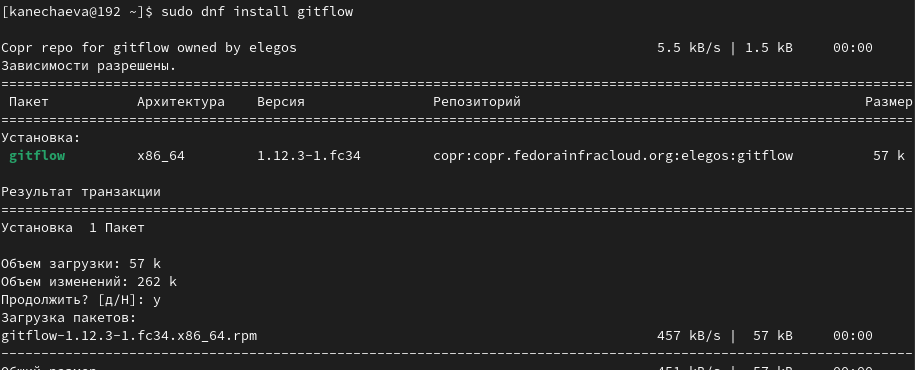
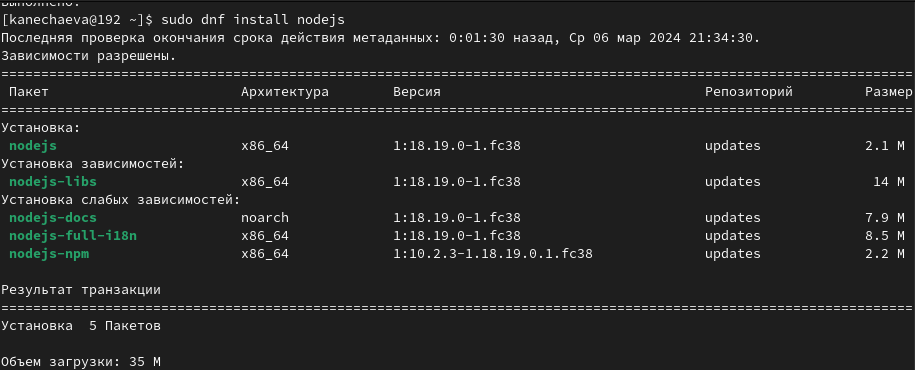
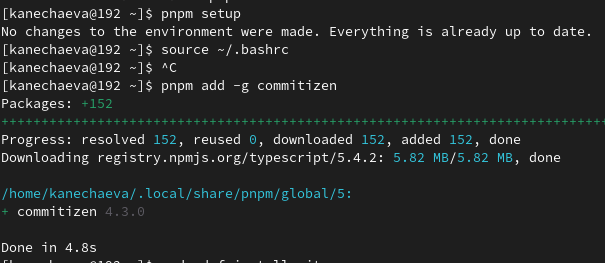
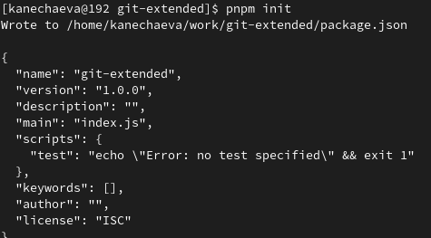
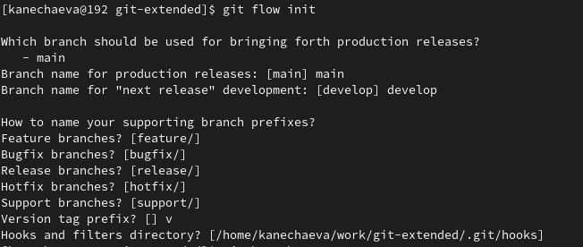
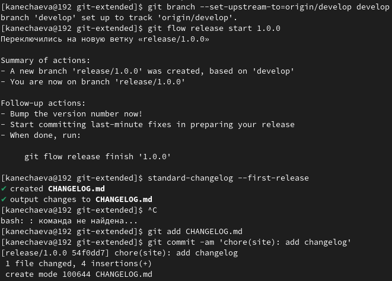
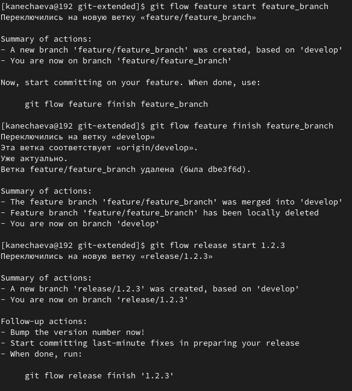

---
## Front matter
lang: ru-RU
title: Лабораторная работа №4
subtitle: Операционные системы
author:
  - Нечаева К.А.
institute:
  - Российский университет дружбы народов, Москва, Россия
date: 07 марта 2024

## i18n babel
babel-lang: russian
babel-otherlangs: english

## Formatting pdf
toc: false
toc-title: Содержание
slide_level: 2
aspectratio: 169
section-titles: true
theme: metropolis
header-includes:
 - \metroset{progressbar=frametitle,sectionpage=progressbar,numbering=fraction}
 - '\makeatletter'
 - '\beamer@ignorenonframefalse'
 - '\makeatother'
---

# Информация

## Докладчик

:::::::::::::: {.columns align=center}
::: {.column width="70%"}

  * Нечаева Кира Андреевна
  * Студентка
  * Российский университет дружбы народов
  * [1132236031@pfur.ru](mailto:1132236031@pfur.ru)
 

:::
::: {.column width="30%"}


:::
::::::::::::::

# Вводная часть

## Актуальность

- Важно уметь пользоваться системой Git не только на базоовом уровне
- Необходимо уметь использовать продвинутые функции Git для лучшй систематизации работы и рабочего пространства

## Объект и предмет исследования

- Git
- Github
- git-flow
- node.js

## Цели и задачи

- Получение навыков правильной работы с репозиториями git.

## Материалы и методы

- система Git
- Консоль (терминал) Linux

# Ход лабораторной работы

## Установка git-flow

Для начала я устанавливаю git-flow. 


## Установка Node.js

Теперь мне нужно установить Node.js и pnpm.


## Первоначальная настройка Node.js

Для начала я запускаю pnpm, после выполняю команду для того, чтобы "перелогиниться". И в конце я использую программу commitizen для помощи в форматировании коммитов. 


## Создание репозитория git

Теперь я создаю репозиторий на гитхаб и клонирую его к себе в рабочее пространство на компьютере.

После этого я делаю первый коммит и выкладываю на github. 

## Конфигурация для пакетов Node.js

Пишу команду pnpm init. Вообще необходимо заполнить несколько параметров, но поскольку я иначе скачивала этот пакет, то у меня ужен всё заполнено.

Добавляю файлы, выполняю коммит и отправляю их (файлы) на гитхаб.

## Работа с git-flow

Теперь инициализирую git-flow, префикс для ярлыков я ставлю "v".

Проверяю, что я на ветке develop и загружаю весь репозиторий в хранилище. 

## Создание иерархии веток и журнала изменений

Устанавливаю внешнюю ветку как вышестоящую для этой ветки, создаю релиз с версией 1.0.0 и журнал изменений. Затем добавляю журнал изменений в индекс.
После всего этого заливаю релизную ветку в основную ветку, отправляю данные на github и там же создаю релиз. 


## Работа с репозиторием git. Разработка новой функциональности

В начале создаю ветку для новой функциональности. По окончании разработки новой функциональности следующим шагом объединяю ветку feature_branch c develop и создадю релиз с версией 1.2.3.


Теперь заливаю релизную ветку в основную ветку и оправляю данные на github  вместе с новым журналом изменений.


# Результаты

- Я получила навыки правильной работы с репозиториями git.


# Список литературы{.unnumbered}

::: {https://esystem.rudn.ru/mod/page/view.php?id=1098794&forceview=1#org6cf8374}
:::


## Код для формата `pdf`

```yaml
slide_level: 2
aspectratio: 169
section-titles: true
theme: metropolis
```


## Код для формата `html`


```make
REVEALJS_THEME = beige 
```


