---
## Front matter
title: "Отчёт по лабораторной работе №4"
subtitle: "Дисциплина: Операционные сиситемы"
author: "Нечаева Кира Андреевна"

## Generic otions
lang: ru-RU
toc-title: "Содержание"

## Bibliography
bibliography: bib/cite.bib
csl: pandoc/csl/gost-r-7-0-5-2008-numeric.csl

## Pdf output format
toc: true # Table of contents
toc-depth: 2
lof: true # List of figures
lot: true # List of tables
fontsize: 12pt
linestretch: 1.5
papersize: a4
documentclass: scrreprt
## I18n polyglossia
polyglossia-lang:
  name: russian
  options:
	- spelling=modern
	- babelshorthands=true
polyglossia-otherlangs:
  name: english
## I18n babel
babel-lang: russian
babel-otherlangs: english
## Fonts
mainfont: PT Serif
romanfont: PT Serif
sansfont: PT Sans
monofont: PT Mono
mainfontoptions: Ligatures=TeX
romanfontoptions: Ligatures=TeX
sansfontoptions: Ligatures=TeX,Scale=MatchLowercase
monofontoptions: Scale=MatchLowercase,Scale=0.9
## Biblatex
biblatex: true
biblio-style: "gost-numeric"
biblatexoptions:
  - parentracker=true
  - backend=biber
  - hyperref=auto
  - language=auto
  - autolang=other*
  - citestyle=gost-numeric
## Pandoc-crossref LaTeX customization
figureTitle: "Рис."
tableTitle: "Таблица"
listingTitle: "Листинг"
lofTitle: "Список иллюстраций"
lotTitle: "Список таблиц"
lolTitle: "Листинги"
## Misc options
indent: true
header-includes:
  - \usepackage{indentfirst}
  - \usepackage{float} # keep figures where there are in the text
  - \floatplacement{figure}{H} # keep figures where there are in the text
---

# **Цель работы**

Целью работы является получение навыков правильной работы с репозиториями git.

# **Задание**
    1. Установка программного обеспечения
        1.1. Установка git-flow
        1.2. Установка Node.js
        1.3. Настройка Node.js
            1.3.1 Первоначальная настройка Node.js
            1.3.2 Создание репозитория git
            1.3.3 Конфигурация для пакетов Node.js
        1.4. Работа с репозиторием git. Разработка новой функциональности

# **Выолнение лабораторной работы**
## **Установка программного обеспечения**

### *Установка git-flow*

Поскольку я работаю на Fedora, то мне подребуется сначала включить репозиторий copr. (рис. [-@fig:001])
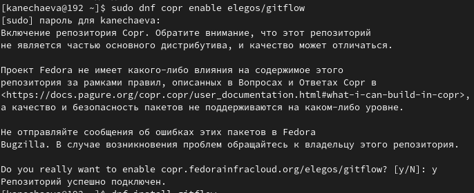{#fig:001 width=70%}

И затем уже я устанавливаю git-flow. (рис. [-@fig:002])
{#fig:002 width=70%}

### *Установка Node.js*

Теперь мне нужно установить Node.js. (рис. [-@fig:003])
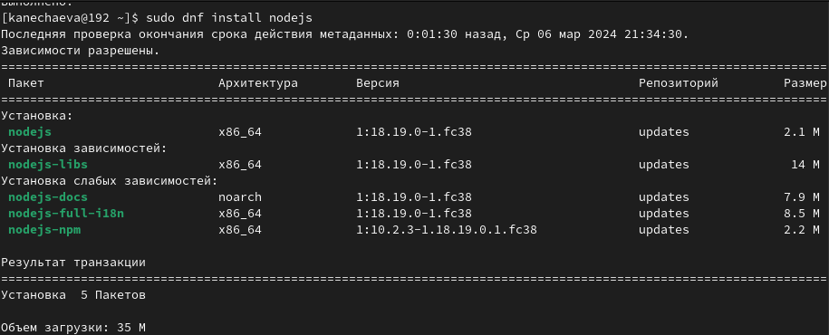{#fig:003 width=70%}

И после этого я скачиваю через npm pnpm. (рис. [-@fig:004])
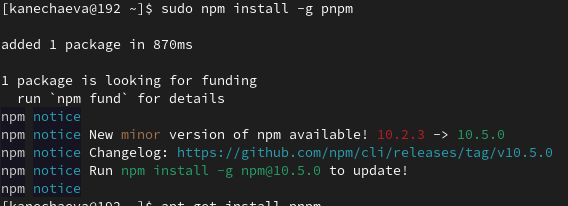{#fig:004 width=70%}

### *Настройка Node.js*

#### ***Первоначальная настройка Node.js***

Для начала я запускаю pnpm, после выполняю команду для того, чтобы "перелогиниться". И в конце я использую программу commitizen для помощи в форматировании коммитов. (рис. [-@fig:005])
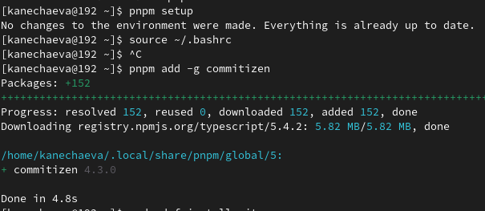{#fig:005 width=70%}

Тепперь для создания логов я использую следующую команду. (рис. [-@fig:006])
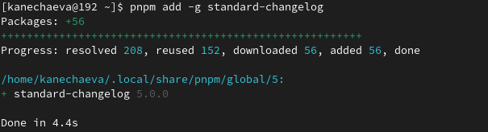{#fig:006 width=70%}

#### ***Создание репозитория git***

Теперь я создаю репозиторий на гитхаб. (рис. [-@fig:007])
{#fig:007 width=70%}

Сразу клонирую его к себе в рабочее пространство на компьютере. (рис. [-@fig:008])
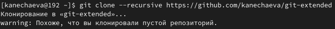{#fig:008 width=70%}

После этого я делаю первый коммит и выкладываю на github. (рис. [-@fig:009])
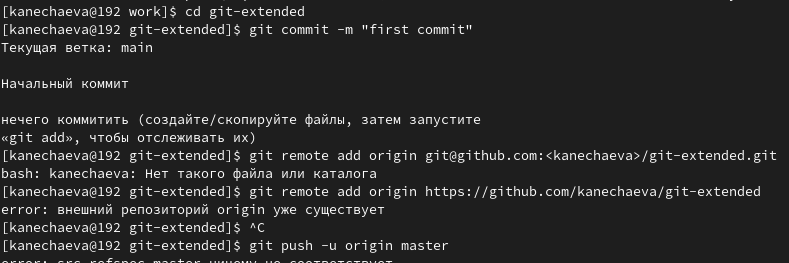{#fig:009 width=70%}

#### ***Конфигурация для пакетов Node.js***

Пишу команду pnpm init. Вообще необходимо заполнить несколько параметров, но поскольку я иначе скачивала этот пакет, то у меня ужен всё заполнено. (рис. [-@fig:010])
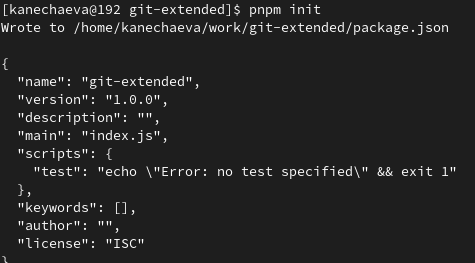{#fig:010 width=70%}
Необходимо заполнить несколько параметров пакета.

Добавляю файлы, выполняю коммит и отправляю их (файлы) на гитхаб. (рис. [-@fig:011]), (рис. [-@fig:012])
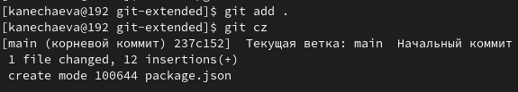{#fig:011 width=70%}
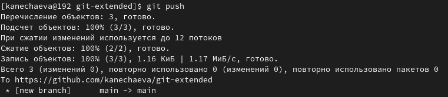{#fig:012 width=70%}

Теперь инициализирую git-flow, префикс для ярлыков я ставлю "v". (рис. [-@fig:013])
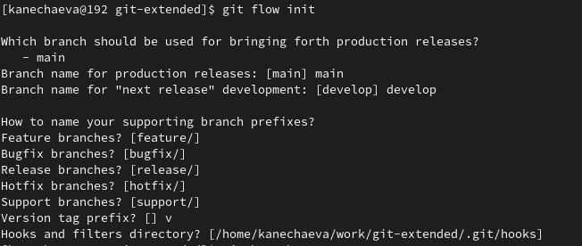{#fig:013 width=70%}

Проверяю, что я на ветке develop и загружаю весь репозиторий в хранилище. (рис. [-@fig:014])
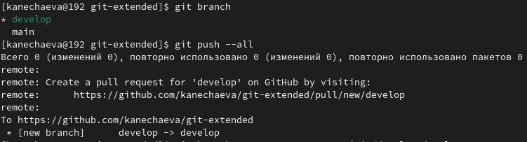{#fig:014 width=70%}

Устанавливаю внешнюю ветку как вышестоящую для этой ветки, создаю релиз с версией 1.0.0 и журнал изменений.
Затем добавляю журнал изменений в индекс. (рис. [-@fig:015])
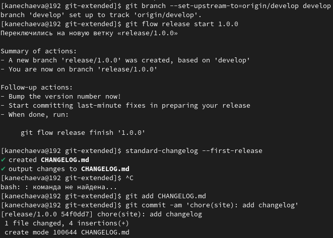{#fig:015 width=70%}

После всегго этого заливаю релизную ветку в основную ветку, отправляю данные на github и там же создаю релиз. (рис. [-@fig:016])
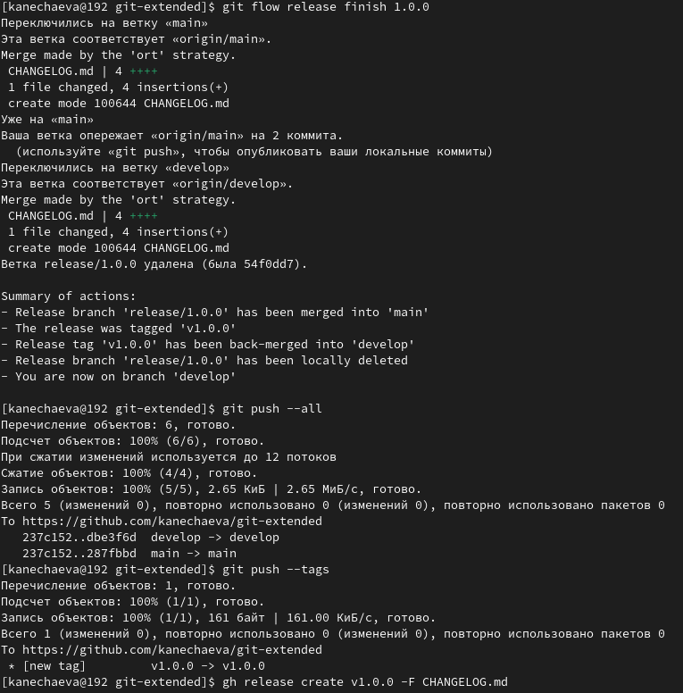{#fig:016 width=70%}

### *Работа с репозиторием git. Разработка новой функциональности*

В начале создаю ветку для новой функциональности. По окончании разработки новой функциональности следующим шагом объединяю ветку feature_branch c develop и создадю релиз с версией 1.2.3. (рис. [-@fig:017])
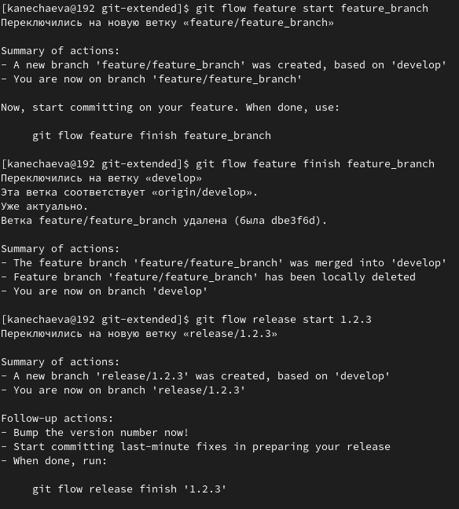{#fig:017 width=70%}

Теперь создаю журнал изменений и добавляю его в индекс. (рис. [-@fig:018])
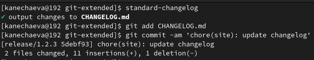{#fig:018 width=70%}

Наконец залью релизную ветку в основную ветку и оправлю данные на github. (рис. [-@fig:019])
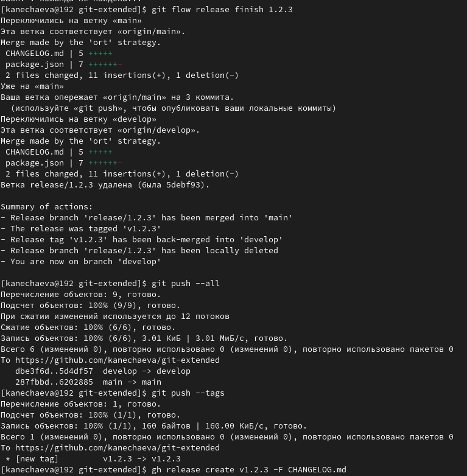{#fig:019 width=70%}

И в конце создаю релиз на github с комментарием из журнала изменений. (рис. [-@fig:020])
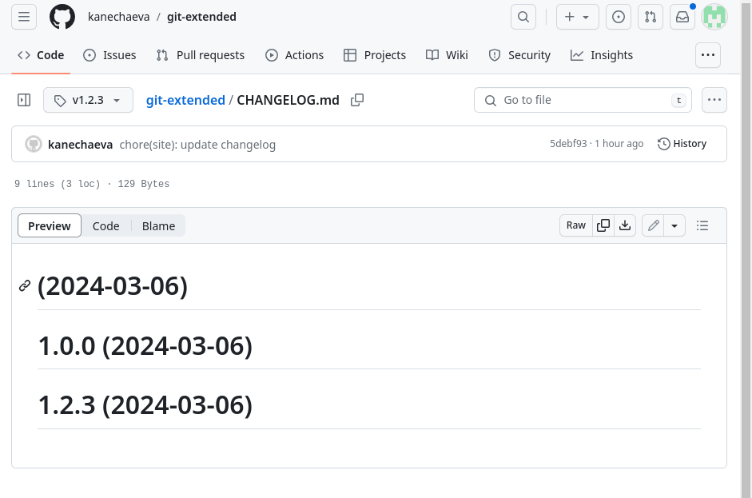{#fig:020 width=70%}

# **Вывод**
При выполнении данной лабораторной работы я получила навыки правильной работы с репозиториями git.

# Список литературы{.unnumbered}

::: {https://esystem.rudn.ru/mod/page/view.php?id=1098794&forceview=1#org6cf8374}
:::
