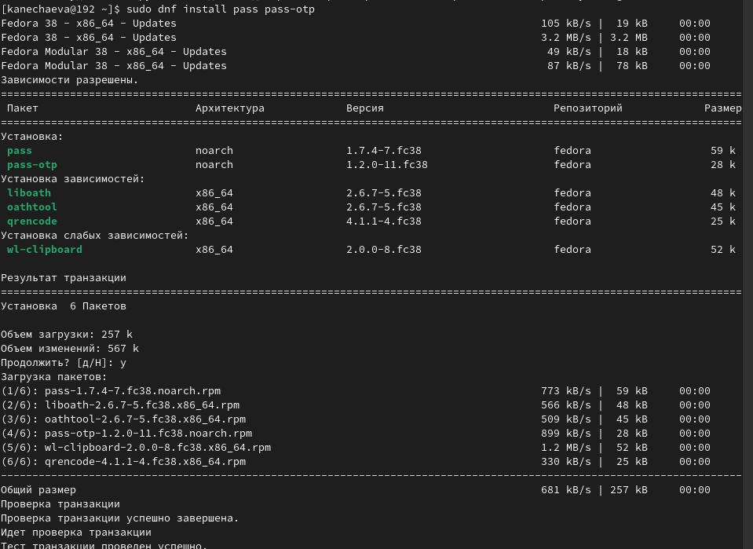
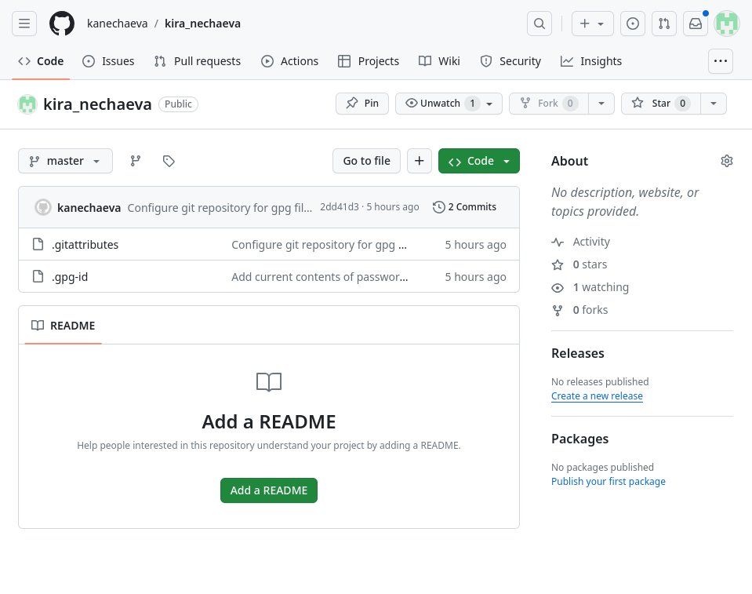
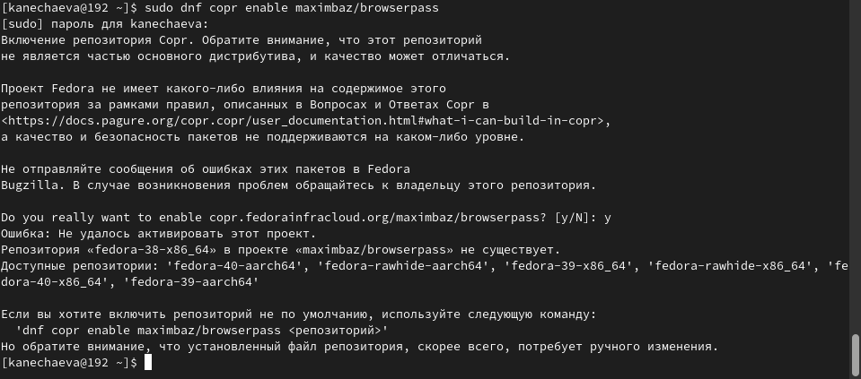
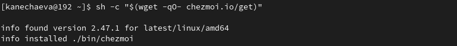
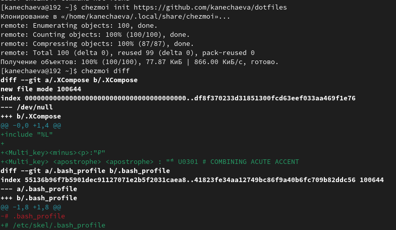
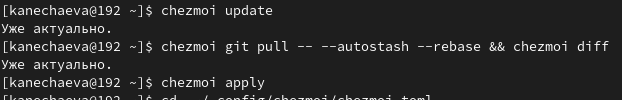

---
## Front matter
lang: ru-RU
title: Лабораторная работа №5
subtitle: Операционные системы
author:
  - Нечаева К.А.
institute:
  - Российский университет дружбы народов, Москва, Россия
date: 09 марта 2024

## i18n babel
babel-lang: russian
babel-otherlangs: english

## Formatting pdf
toc: false
toc-title: Содержание
slide_level: 2
aspectratio: 169
section-titles: true
theme: metropolis
header-includes:
 - \metroset{progressbar=frametitle,sectionpage=progressbar,numbering=fraction}
 - '\makeatletter'
 - '\beamer@ignorenonframefalse'
 - '\makeatother'
---

# Информация

## Докладчик

:::::::::::::: {.columns align=center}
::: {.column width="70%"}

  * Нечаева Кира Андреевна
  * Студентка
  * Российский университет дружбы народов
  * [1132236031@pfur.ru](mailto:1132236031@pfur.ru)
 

:::
::: {.column width="30%"}

:::
::::::::::::::

# Вводная часть

## Актуальность

- Важно уметь настроить и автоматизировать рабочую среду
- Необходимо уметь использовать продвинутые функции Git для лучшй систематизации работы и рабочего пространства

## Объект и предмет исследования

- Git
- Github
- pass
- browserpass

## Цели и задачи

- Целью работы является научиться настраивать рабочую среду.

## Материалы и методы

- система Git
- Консоль (терминал) Linux

# Ход лабораторной работы

## Установка

Для начала мне нужно установить на Fedora pass и gopass. 

## Настройка

Теперь я просмотрю список ключей GPG и инициализирую хранилище. 

И сейчас от меня требуется синхронизироваться с git. Для этого я создаю структуру git.

Теперь, поскольку изменения сделаны непосредственно на файловой системе, мне нужно вручную закоммитить, выложить изменения и проверить статус синхронизации. 

Вот так выглядит мой новый репозиторий с изменениями. 

## Настройка интерфейса с браузером

Для взаимодействия с браузером используется интерфейс native messaging. Поэтому кроме плагина к броузеру я устанавливаю программу, обеспечивающую интерфейс native messaging, а именно плагин browserpas.

## Сохранение пароля

Теперь я добавляю новый пароль и отображаю его. После чего заменяю его на сгенерированный программой пароль. 

## Управление файлами конфигурации

Для начала я установлю дополнительное программное обеспечение и шрифты. 

После этого мне нужно установить бинарный файл. Скрипт сам определит архитектуру процессора и операционную систему и скачает необходимый файл. 

## Создание собственного репозитория с помощью утилит

Чтобы подключить новый репозиторий к системе, я инициализирую chezmoi с dotfiles. После я проверяю, какие изменения внесёт chezmoi в домашний каталог. 

## Ежедневные операции c chezmoi

Извлечь изменения из репозитория и применить их можно одной командой chezmoi update.
Теперь я извлекаю последние изменения из своего репозитория и смотрю, что изменится. Фактически я в данном случае не применяю изменения.
Так как я довольна изменениями, я применяю их с помощью chezmoi apply. 

# Результаты

При выполнении данной лабораторной работы я научилась настраивать рабочую среду.

# Список литературы

1. [Электронный ресурс](https://esystem.rudn.ru/mod/page/view.php?id=1098796&forceview=1#org2695679)

