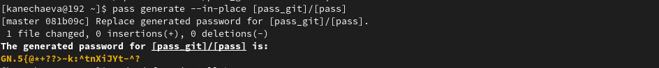
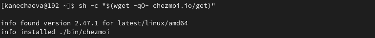
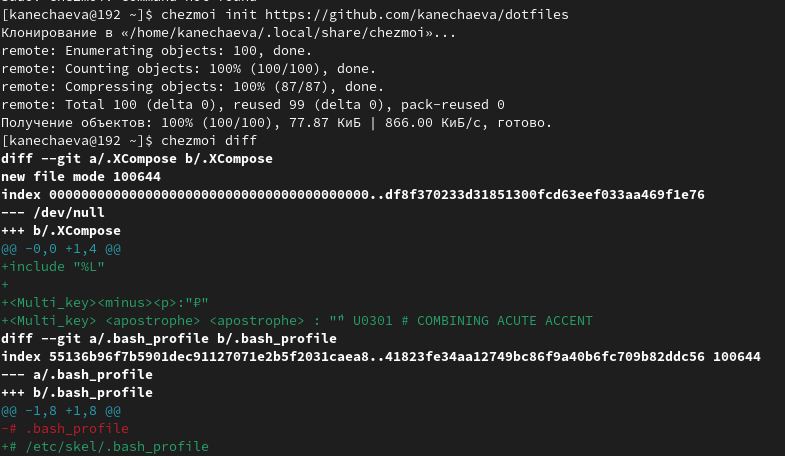

---
## Front matter
title: "Отчёт по лабораторной работе №5"
subtitle: "Дисциплина: Операционные системы"
author: "Нечаева Кира Андреевна"

## Generic otions
lang: ru-RU
toc-title: "Содержание"

## Bibliography
bibliography: bib/cite.bib
csl: pandoc/csl/gost-r-7-0-5-2008-numeric.csl

## Pdf output format
toc: true # Table of contents
toc-depth: 2
lof: true # List of figures
lot: true # List of tables
fontsize: 12pt
linestretch: 1.5
papersize: a4
documentclass: scrreprt
## I18n polyglossia
polyglossia-lang:
  name: russian
  options:
	- spelling=modern
	- babelshorthands=true
polyglossia-otherlangs:
  name: english
## I18n babel
babel-lang: russian
babel-otherlangs: english
## Fonts
mainfont: PT Serif
romanfont: PT Serif
sansfont: PT Sans
monofont: PT Mono
mainfontoptions: Ligatures=TeX
romanfontoptions: Ligatures=TeX
sansfontoptions: Ligatures=TeX,Scale=MatchLowercase
monofontoptions: Scale=MatchLowercase,Scale=0.9
## Biblatex
biblatex: true
biblio-style: "gost-numeric"
biblatexoptions:
  - parentracker=true
  - backend=biber
  - hyperref=auto
  - language=auto
  - autolang=other*
  - citestyle=gost-numeric
## Pandoc-crossref LaTeX customization
figureTitle: "Рис."
tableTitle: "Таблица"
listingTitle: "Листинг"
lofTitle: "Список иллюстраций"
lotTitle: "Список таблиц"
lolTitle: "Листинги"
## Misc options
indent: true
header-includes:
  - \usepackage{indentfirst}
  - \usepackage{float} # keep figures where there are in the text
  - \floatplacement{figure}{H} # keep figures where there are in the text
---

# Цель работы

Целью работы является научиться настраивать рабочую среду.

# Задание
1. Менеджер паролей pass
    1. Установка
    2. Настройка
2. Настройка интерфейса с браузером
3. Сохранение пароля
4. Управление файлами конфигурации
5. Создание собственного репозитория с помощью утилит
6. Ежедневные операции c chezmoi

# Выполнение лабораторной работы

## Менеджер паролей pass

### Установка

Для начала мне нужно установить на Fedora pass и gopass. (рис. [-@fig:001]), (рис. [-@fig:002])

{#fig:001 width=70%}

{#fig:002 width=70%}

### Настройка

Теперь я просмотрю список ключей GPG и инициализирую хранилище. (рис. [-@fig:003])

{#fig:003 width=70%}

И сейчас от меня требуется синхронизироваться с git. Для этого я создаю структуру git. (рис. [-@fig:004])

{#fig:004 width=70%}

Теперь, поскольку изменения сделаны непосредственно на файловой системе, мне нужно вручную закоммитить, выложить изменения и проверить статус синхронизации. (рис. [-@fig:005])

{#fig:005 width=70%}

Вот так выглядит мой новый репозиторий с изменениями. (рис. [-@fig:006])

{#fig:006 width=70%}

## Настройка интерфейса с браузером

Для взаимодействия с браузером используется интерфейс native messaging. Поэтому кроме плагина к броузеру я устанавливаю программу, обеспечивающую интерфейс native messaging, а именно плагин browserpas. (рис. [-@fig:007])

{#fig:007 width=70%}

Вот как это выглядит на каком-либо сайте. (рис. [-@fig:008])

{#fig:008 width=70%}

## Сохранение пароля

Теперь я добавляю новый пароль и отображаю его. (рис. [-@fig:009])

{#fig:009 width=70%}

После чего заменяю его на сгенерированный программой пароль. (рис. [-@fig:010])

{#fig:010 width=70%}

## Управление файлами конфигурации

Для начала я установлю дополнительное программное обеспечение. (рис. [-@fig:011])

{#fig:011 width=70%}

Теперь установлю шрифты. (рис. [-@fig:012]), (рис. [-@fig:013])

{#fig:012 width=70%}

{#fig:013 width=70%}

После этого мне нужно установить бинарный файл. Скрипт сам определит архитектуру процессора и операционную систему и скачает необходимый файл. (рис. [-@fig:014])

{#fig:014 width=70%}

## Создание собственного репозитория с помощью утилит

Создам свой репозиторий для конфигурационных файлов на основе шаблона с помощью утилит. (рис. [-@fig:015])

{#fig:015 width=70%}

Теперь мне нужно подключить репозиторий к своей системе. Для этого я инициализирую chezmoi с моим репозиторием dotfiles. После я проверяю, какие изменения внесёт chezmoi в домашний каталог, запустив chezmoi diff. (рис. [-@fig:016])

{#fig:016 width=70%}

Изменения меня устраивают, так что я запускаю chezmoi apply -v. (скриншот не сохранился)

Виртуальная машина у меня отсутствует, так что следующие несколько шагов я пропускаю.

## Ежедневные операции c chezmoi

Извлечь изменения из репозитория и применить их можно одной командой chezmoi update.
Теперь я извлекаю последние изменения из своего репозитория и смотрю, что изменится. Фактически я в данном случае не применяю изменения.
Так как я довольна изменениями, я применяю их с помощью chezmoi apply. (рис. [-@fig:017])

{#fig:017 width=70%}

Можно автоматически фиксировать и отправлять изменения в исходный каталог в репозиторий. Чтобы включить её, я добавляю в файл конфигурации ~/.config/chezmoi/chezmoi.toml следующее. (рис. [-@fig:018])

{#fig:018 width=70%}

Всякий раз, когда в исходный каталог вносятся изменения, chezmoi теперь будет фиксировать изменения с помощью автоматически сгенерированного сообщения фиксации и отправлять их в мой репозиторий.

# Вывод

При выполнении данной лабораторной работы я научилась настраивать рабочую среду.

# Список литературы{.unnumbered}

1. [Электронный ресурс](https://esystem.rudn.ru/mod/page/view.php?id=1098796&forceview=1#org2695679)

