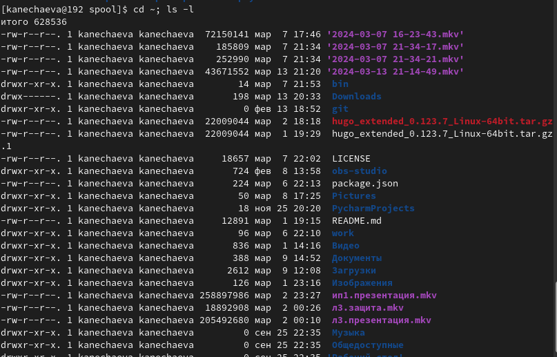
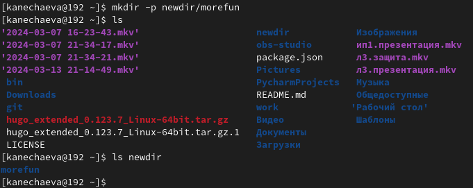
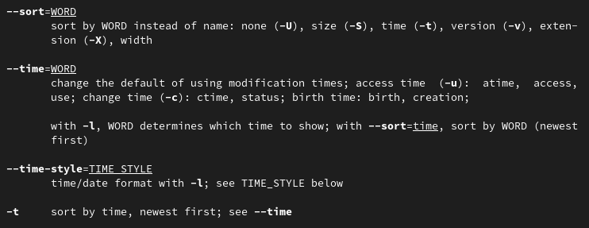
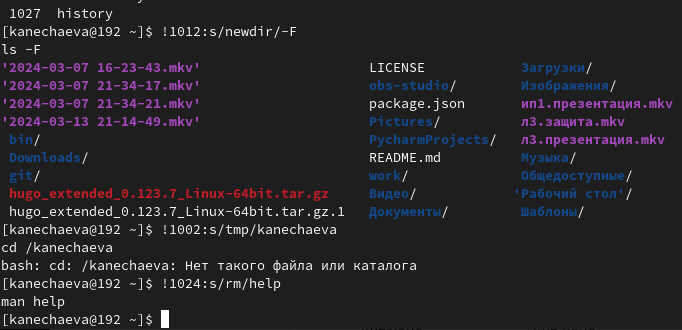

---
## Front matter
lang: ru-RU
title: Лабораторная работа №6
subtitle: Операционные системы
author:
  - Нечаева К.А.
institute:
  - Российский университет дружбы народов, Москва, Россия
date: 13 марта 2024

## i18n babel
babel-lang: russian
babel-otherlangs: english

## Formatting pdf
toc: false
toc-title: Содержание
slide_level: 2
aspectratio: 169
section-titles: true
theme: metropolis
header-includes:
 - \metroset{progressbar=frametitle,sectionpage=progressbar,numbering=fraction}
 - '\makeatletter'
 - '\beamer@ignorenonframefalse'
 - '\makeatother'
---

# Информация

## Докладчик

:::::::::::::: {.columns align=center}
::: {.column width="70%"}

  * Нечаева Кира Андреевна
  * Студентка
  * Российский университет дружбы народов
  * [1132236031@pfur.ru](mailto:1132236031@pfur.ru)
 

:::
::: {.column width="30%"}

:::
::::::::::::::

# Вводная часть

## Актуальность

- Важно уметь работать с командной строкой.
- Необходимо уметь использовать различные опции команд для оптимизации рабочего процесса.

## Объект и предмет исследования

- Терминал
- язык bash

## Цели и задачи

- Целью работы является приобретение практических навыков взаимодействия пользователя с системой посредством командной строки.

## Материалы и методы

- Консоль (терминал) Linux

# Ход лабораторной работы

## Команды cd и ls

Сначала я перехожу в каталог /tmp и вывожу на экран его содержимое.
С помощью опции -alF на экран можно вывести все файлы, включая скрытые и всю подробную информацию о них. 
Теперь перехожу в мой домашний каталог и вывожу на экран его содержимое. Можно заметить, что владельцем файлов и подкаталогов является kanechaeva, то есть я.

## Команды mkdir и rm

В домашнем каталоге я создаю новый каталог с именем newdir, а в нем уже подкаталог с именем morefun.

Теперь удаляю ~/newdir командой rm с ключом -r, который позволяет удалять не пустые каталоги.

## Команда man

С помощью команды man определяю набор опций команды ls, позволяющий отсортировать по времени последнего изменения выводимый список содержимого каталога с развёрнутым описанием файлов.

После этого использую команду man для просмотра описания следующих команд: cd, pwd, mkdir, rmdir, rm.

## Основные опции команды cd:

- -P-e - позволяет выйти с ошибкой, если директория, в которую осуществляется переход, не найдена.
- .. - позволяет перейти в предыдущий каталог.
- ~ - возвращает в домашний каталог.

## Основные опции команды pwd:

- -P - отбрасывает все символические ссылки.
- --help - отображает справку по утилите.
- --version - отображает версию утилиты.

## Основные опции команды mkdir:

- <drive - указывает диск, на котором нужно создать новый каталог. 
- <path	- указывает имя и расположение нового каталога (обязательный параметр).
- /? - отображает справку в командной строке.

## Основные опции команды rmdir:

- -p - позволяет удалить директорию и ее родительские директории, если они остаются пустыми после удаления. 
- --ignore-fail-on-non-empty - позволяет проигнорировать сообщение об ошибке, если директория не пустая. 
- --verbose - выводит подробную информацию о процессе удаления директории

## Основные опции команды rm:

- -r - позволяет удалить не пустую директорию
- -i - выводит запрос на подтверждение каждой операции удаления.
- -f - не возвращает код ошибочного завершения, если ошибки были вызваны несуществующими файлами.

## Команда history

После этого, используя информацию, полученную при помощи команды history, я выполняю модификацию и исполнение двух команд из буфера команд.

# Результаты

При выполнении данной лабораторной работы я приобрела практические навыки взаимодействия пользователя с системой посредством командной строки.

# Список литературы

1. [Электронный ресурс](https://esystem.rudn.ru/mod/resource/view.php?id=1098798)

