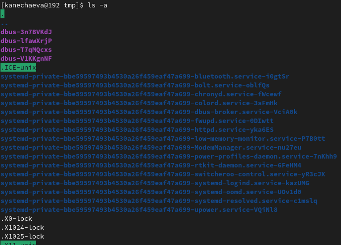
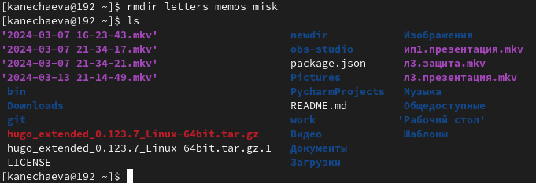

---
## Front matter
title: "Отчёт по лабораторной работе №6"
subtitle: "Дисциплина: Операционные системы"
author: "Нечаева Кира Андреевна"

## Generic otions
lang: ru-RU
toc-title: "Содержание"

## Bibliography
bibliography: bib/cite.bib
csl: pandoc/csl/gost-r-7-0-5-2008-numeric.csl

## Pdf output format
toc: true # Table of contents
toc-depth: 2
lof: true # List of figures
lot: true # List of tables
fontsize: 12pt
linestretch: 1.5
papersize: a4
documentclass: scrreprt
## I18n polyglossia
polyglossia-lang:
  name: russian
  options:
	- spelling=modern
	- babelshorthands=true
polyglossia-otherlangs:
  name: english
## I18n babel
babel-lang: russian
babel-otherlangs: english
## Fonts
mainfont: PT Serif
romanfont: PT Serif
sansfont: PT Sans
monofont: PT Mono
mainfontoptions: Ligatures=TeX
romanfontoptions: Ligatures=TeX
sansfontoptions: Ligatures=TeX,Scale=MatchLowercase
monofontoptions: Scale=MatchLowercase,Scale=0.9
## Biblatex
biblatex: true
biblio-style: "gost-numeric"
biblatexoptions:
  - parentracker=true
  - backend=biber
  - hyperref=auto
  - language=auto
  - autolang=other*
  - citestyle=gost-numeric
## Pandoc-crossref LaTeX customization
figureTitle: "Рис."
tableTitle: "Таблица"
listingTitle: "Листинг"
lofTitle: "Список иллюстраций"
lotTitle: "Список таблиц"
lolTitle: "Листинги"
## Misc options
indent: true
header-includes:
  - \usepackage{indentfirst}
  - \usepackage{float} # keep figures where there are in the text
  - \floatplacement{figure}{H} # keep figures where there are in the text
---

# Цель работы

Целью работы является приобретение практических навыков взаимодействия пользователя с системой посредством командной строки.

# Задание
1. Команды pwd, cd и ls
2. Команды mkdir и rm
3. Команда man
4. Команда history

# Выполнение лабораторной работы

## Команды pwd, cd и ls

Для начала я определяю полное имя моего домашнего каталога. Далее относительно этого каталога будут выполняться последующие действия. (рис. [-@fig:001])

{#fig:001 width=70%}

Теперь я перехожу в каталог /tmp и вывожу на экран его содержимое. (рис. [-@fig:002])

{#fig:002 width=70%}

Затем я вывожу его содержимое с помощью команды ls без каких-либо опций. (рис. [-@fig:003])

{#fig:003 width=70%}

С помощью опции -а на экран можно вывести все файлы, включая скрытые. Скрытые файлы начинаются с точки и выделены зеленым цветом. (рис. [-@fig:004])

{#fig:004 width=70%}

С помощью опции -alF на экран можно вывести все файлы, включая скрытые и всю подробную информацию о них. (рис. [-@fig:005])

{#fig:005 width=70%}

После этого я перехожу в каталог /var/spool и вижу, что в нем отсутствует искомый подкаталог с именем cron. (рис. [-@fig:006])

{#fig:006 width=70%}

Теперь перехожу в мой домашний каталог и вывожу на экран его содержимое. Можно заметить, что владельцем файлов и подкаталогов является kanechaeva, то есть я. (рис. [-@fig:007])

{#fig:007 width=70%}

## Команды mkdir и rm

В домашнем каталоге я создаю новый каталог с именем newdir, а в нем уже подкаталог с именем morefun. (рис. [-@fig:008])

{#fig:008 width=70%}

Теперь в домашнем каталоге создаю одной командой три новых каталога с именами letters, memos, misk. (рис. [-@fig:009])

{#fig:009 width=70%}

Затем удаляю эти каталоги так же дной командой. (рис. [-@fig:010])

{#fig:010 width=70%}

Пробую удалить ранее созданный каталог ~/newdir командой rm. Он не был удален, так как команда rm без опций удаляет только файлы. (рис. [-@fig:011])

{#fig:011 width=70%}

Теперь удаляю ~/newdir командой rm с ключом -r. Всё получается, так как данный ключ позволяет удалять не пустые каталоги. (рис. [-@fig:012])

{#fig:012 width=70%}

## Команда man

С помощью команды man мне нужно определить, какую опцию команды ls нужно использовать для просмотра содержимое не только указанного каталога, но и подкаталогов, входящих в него. (рис. [-@fig:013])

{#fig:013 width=70%}

Оказывается, для данного действия подходит команда ls *. 

Теперь определияю набор опций команды ls, позволяющий отсортировать по времени последнего изменения выводимый список содержимого каталога с развёрнутым описанием файлов. (рис. [-@fig:014])

{#fig:014 width=70%}

Затем я использую команду man для просмотра описания следующих команд: cd, pwd, mkdir, rmdir, rm. (рис. [-@fig:015])

{#fig:015 width=70%}

Основные опции команды cd:

- -P-e - позволяет выйти с ошибкой, если директория, в которую осуществляется переход, не найдена.
- .. - позволяет перейти в предыдущий каталог.
- ~ - возвращает в домашний каталог.

Основные опции команды pwd:

- P - отбрасывает все символические ссылки.
- --help - отображает справку по утилите.
- --version - отображает версию утилиты.

Основные опции команды mkdir:

- <drive - указывает диск, на котором нужно создать новый каталог. 
- <path	- указывает имя и расположение нового каталога (обязательный параметр).
- /? - отображает справку в командной строке.

Основные опции команды rmdir:

- -p - позволяет удалить директорию и ее родительские директории, если они остаются пустыми после удаления. 
- --ignore-fail-on-non-empty - позволяет проигнорировать сообщение об ошибке, если директория не пустая. 
- --verbose - выводит подробную информацию о процессе удаления директории

Основные опции команды rm:

- -r - позволяет удалить не пустую директорию
- -i - выводит запрос на подтверждение каждой операции удаления.
- -f - не возвращает код ошибочного завершения, если ошибки были вызваны несуществующими файлами.

## Команда history

После этого, используя информацию, полученную при помощи команды history, я выполняю модификацию и исполнение двух команд из буфера команд. (рис. [-@fig:016])

{#fig:016 width=70%}

# Вывод

При выполнении данной лабораторной работы я приобрела практические навыки взаимодействия пользователя с системой посредством командной строки.

# Список литературы{.unnumbered}

1. [Электронный ресурс](https://esystem.rudn.ru/mod/resource/view.php?id=1098798)

