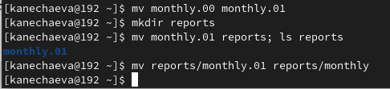
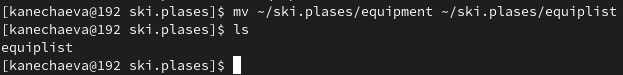
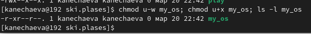
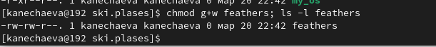
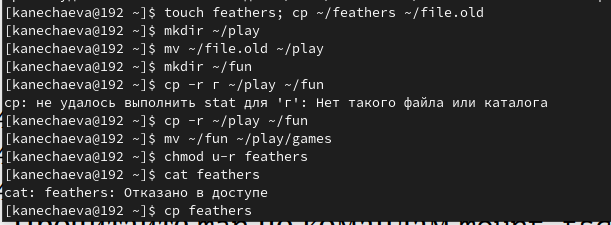

---
## Front matter
lang: ru-RU
title: Лабораторная работа №7
subtitle: Операционные системы
author:
  - Нечаева К.А.
institute:
  - Российский университет дружбы народов, Москва, Россия
date: 23 марта 2024

## i18n babel
babel-lang: russian
babel-otherlangs: english

## Formatting pdf
toc: false
toc-title: Содержание
slide_level: 2
aspectratio: 169
section-titles: true
theme: metropolis
header-includes:
 - \metroset{progressbar=frametitle,sectionpage=progressbar,numbering=fraction}
 - '\makeatletter'
 - '\beamer@ignorenonframefalse'
 - '\makeatother'
---

# Информация

## Докладчик

:::::::::::::: {.columns align=center}
::: {.column width="70%"}

  * Нечаева Кира Андреевна
  * Студентка
  * Российский университет дружбы народов
  * [1132236031@pfur.ru](mailto:1132236031@pfur.ru)
 

:::
::: {.column width="30%"}


:::
::::::::::::::

# Вводная часть

## Актуальность

- Важно уметь работать с командной строкой.
- Необходимо уметь использовать различные опции команд для оптимизации рабочего процесса.

## Объект и предмет исследования

- Терминал
- язык bash

## Цели и задачи

- Целью работы является ознакомление с файловой системой Linux, её структурой, именами и содержанием каталогов. Приобретение практических навыков по применению команд для работы с файлами и каталогами, по управлению процессами, по проверке использования диска и обслуживанию файловой системы.

## Материалы и методы

- Консоль (терминал) Linux

# Ход лабораторной работы

## Выполнение примеров

Создаю файл abc1 и каталог monthly. abc1 копирую в файлы april и may. Последние 2 файла копирую в monthly, при этом may копирую в файл june. 

Теперь я создаю каталог monthly.00, в который рекурсивно копирую каталог monthly, а после этого копирую monthly.00 в /tmp. Изменяю название файла april на july и перемещаю его в monthly.00. 

Теперь переименовываю monthly.00 в monthly.01 и перемещаю в каталог reports. Последний каталог переименовываю.



## Перемещение и копирование файлов и каталогов

Сначала я копирую файл /usr/include/sys/io.h с названием equipment в домашний каталог, где создаю директорию ~/ski.plases и перемещаю в неё equipment.

Далее переименовываю файл ~/ski.plases/equipment в ~/ski.plases/equiplist. 

Теперь создаю файл equiplist2 в каталоге ~/ski.plases. Затем создаю каталог equipment и перемещаю в него equiplist и equiplist2.

Наконец, создаю каталог ~/newdir в ~/ski.plases и называю его plans.



## Команда chmod

Теперь мне необходимо присвоить определенные права для некоторых файлов, а именно:





## Применение команды chmod

Для начала я копирую файл ~/feathers в файл ~/file.old и перемещаю его в каталог ~/play, который затем ркурсивно копирую его в каталог ~/fun. 

Теперь перемещаю каталог ~/fun в ~/play и называю его games. Затем я лишаю владельца ~/feathers права на чтение, из-за чего при попытке использовать cat нам отказывают в доступе, а пнри копировании конфликтов не возникает.



## Чтение man по командам

mount: Команда mount используется для подключения файловых систем к определенным точкам монтирования в иерархии файловой системы.
``` bash
mount /dev/sda1 /mnt
```
fsck: Команда fsck используется для проверки и исправления целостности файловой системы.
``` bash
fsck /dev/sda1
```
mkfs: Команда mkfs используется для создания новой файловой системы на указанном устройстве.
``` bash
mkfs -t ext4 /dev/sdb1
```
kill: Команда kill используется для отправки сигнала процессу или группе процессов для завершения их работы. 

``` bash
kill -9 PID
``` 

# Результаты

При выполнении данной лабораторной работы я ознакомилась с файловой системой Linux, её структурой, именами и содержанием каталогов. А так же приобрела практические навыки по применению команд для работы с файлами и каталогами, по управлению процессами, по проверке использования диска и обслуживанию файловой системы.

# Список литературы

1. [Электронный ресурс](https://esystem.rudn.ru/pluginfile.php/2288087/mod_resource/content/4/005-lab_files.pdf)

