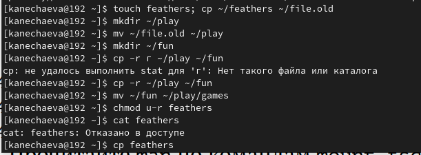

---
## Front matter
title: "Отчёт по лабораторной работе №7"
subtitle: "Дисциплина: Операционные системы"
author: "Нечаева Кира Андреевна"

## Generic otions
lang: ru-RU
toc-title: "Содержание"

## Bibliography
bibliography: bib/cite.bib
csl: pandoc/csl/gost-r-7-0-5-2008-numeric.csl

## Pdf output format
toc: true # Table of contents
toc-depth: 2
lof: true # List of figures
lot: true # List of tables
fontsize: 12pt
linestretch: 1.5
papersize: a4
documentclass: scrreprt
## I18n polyglossia
polyglossia-lang:
  name: russian
  options:
	- spelling=modern
	- babelshorthands=true
polyglossia-otherlangs:
  name: english
## I18n babel
babel-lang: russian
babel-otherlangs: english
## Fonts
mainfont: PT Serif
romanfont: PT Serif
sansfont: PT Sans
monofont: PT Mono
mainfontoptions: Ligatures=TeX
romanfontoptions: Ligatures=TeX
sansfontoptions: Ligatures=TeX,Scale=MatchLowercase
monofontoptions: Scale=MatchLowercase,Scale=0.9
## Biblatex
biblatex: true
biblio-style: "gost-numeric"
biblatexoptions:
  - parentracker=true
  - backend=biber
  - hyperref=auto
  - language=auto
  - autolang=other*
  - citestyle=gost-numeric
## Pandoc-crossref LaTeX customization
figureTitle: "Рис."
tableTitle: "Таблица"
listingTitle: "Листинг"
lofTitle: "Список иллюстраций"
lotTitle: "Список таблиц"
lolTitle: "Листинги"
## Misc options
indent: true
header-includes:
  - \usepackage{indentfirst}
  - \usepackage{float} # keep figures where there are in the text
  - \floatplacement{figure}{H} # keep figures where there are in the text
---

# Цель работы

Целью работы является ознакомление с файловой системой Linux, её структурой, именами и содержанием каталогов. Приобретение практических навыков по применению команд для работы с файлами и каталогами, по управлению процессами, по проверке использования диска и обслуживанию файловой системы.

# Задание
1. Выполнение примеров
2. Перемещение и копирование файлов и каталогов
3. Команда chmod
4. Применение команды chmod


# Выполнение лабораторной работы

## Выполнение примеров

Для начала я выполню все примеры, приведённые в первой части описания лабораторной работы.

1. Создаю файл abc1, который потом копирую в файл april и в may. (рис. [-@fig:001])

{#fig:001 width=70%}

2. Теперь создаю каталог monthly, чтобы в него скопировать файлы april и may. После копирую файл monthly/may в файл с именем june.(рис. [-@fig:002])

{#fig:002 width=70%}

3. Теперь я создаю каталог monthly.00, в который потом рекурсивно копирую каталог monthly. После этого копирую каталог monthly.00 в каталог /tmp. (рис. [-@fig:003])

{#fig:003 width=70%}

4. Изменяю название файла april на july в домашнем каталоге. Затем перемещаю файл july в каталог monthly.00.(рис. [-@fig:004])

{#fig:004 width=70%}

5. Теперь переименю каталог monthly.00 в monthly.01. После перемещаю этот каталог в каталог reports. Последний каталог переименовываю. (рис. [-@fig:005])

{#fig:005 width=70%}

## Перемещение и копирование файлов и каталогов

Сначала я копирую файл /usr/include/sys/io.h в домашний каталог и называю его equipment. (рис. [-@fig:006])

{#fig:006 width=70%}

В домашнем каталоге создаю директорию ~/ski.plases и перемещаю в неё файл equipment. (рис. [-@fig:007])

{#fig:007 width=70%}

Далее переименовываю файл ~/ski.plases/equipment в ~/ski.plases/equiplist. (рис. [-@fig:008])

{#fig:008 width=70%}

Теперь создаю в домашнем каталоге файл abc1 и копирую его в каталог ~/ski.plases, называю его equiplist2. Кроме того я создаю каталог с именем equipment в каталоге ~/ski.plases и перемещаю в него equiplist и equiplist2. (рис. [-@fig:009])

{#fig:009 width=70%}

Наконец, создаю и перемещаю каталог ~/newdir в каталог ~/ski.plases и называю его plans. В конце  проверяю результаты командой ls. (рис. [-@fig:010])

{#fig:010 width=70%}

## Команда chmod

Теперь мне необходимо присвоить определенные права для некоторых файлов, а именно: 
- drwxr--r-- ... australia 
- drwx--x--x ... play 
- -r-xr--r-- ... my_os 
- -rw-rw-r-- ... feathers
(рис. [-@fig:011]), (рис. [-@fig:012]), (рис. [-@fig:013])

{#fig:011 width=70%}

{#fig:012 width=70%}

{#fig:013 width=70%}

## Применение команды chmod

Для начала я копирую файл ~/feathers в файл ~/file.old. После перемещаю файл ~/file.old в каталог ~/play и ркурсивно копирую его в каталог ~/fun. 

Теперь перемещаю каталог ~/fun в каталог ~/play и называю его games. Затем я лишаю владельца файла ~/feathers права на чтение. Естественно, при попытке использовать команду cat нам отказывают в доступе.

При попытке копирования конфликтов не возникает. (рис. [-@fig:014])

{#fig:014 width=70%}

Возвращаю владельцу файла ~/feathers право на чтение, а после лишаю владельца каталога ~/play права на выполнение. И снова возвращаю это право. 

Теперь читаю man по командам mount, fsck, mkfs, kill. (рис. [-@fig:015])

{#fig:015 width=70%}

Информация о командах:

1. mount: Команда mount используется для подключения файловых систем к определенным точкам монтирования в иерархии файловой системы. Пример использования:

``` bash
mount /dev/sda1 /mnt
``` 

2. fsck: Команда fsck используется для проверки и исправления целостности файловой системы. Пример использования:

``` bash
fsck /dev/sda1
``` 

3. mkfs: Команда mkfs используется для создания новой файловой системы на указанном устройстве. Пример использования:

``` bash
mkfs -t ext4 /dev/sdb1
``` 

4. kill: Команда kill используется для отправки сигнала процессу или группе процессов для завершения их работы. Пример использования:

``` bash
kill -9 PID
``` 

# Вывод

При выполнении данной лабораторной работы я ознакомилась с файловой системой Linux, её структурой, именами и содержанием каталогов. А так же приобрела практические навыки по применению команд для работы с файлами и каталогами, по управлению процессами, по проверке использования диска и обслуживанию файловой системы.


# Список литературы{.unnumbered}

1. [Электронный ресурс](https://esystem.rudn.ru/pluginfile.php/2288087/mod_resource/content/4/005-lab_files.pdf)

