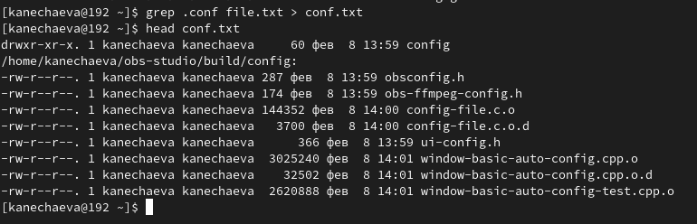
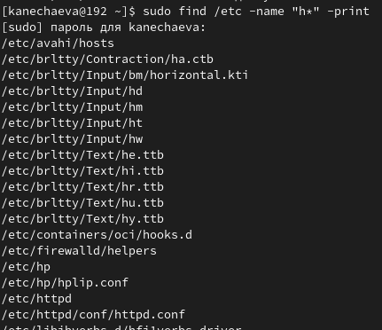
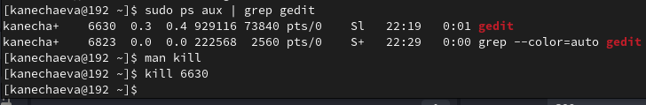
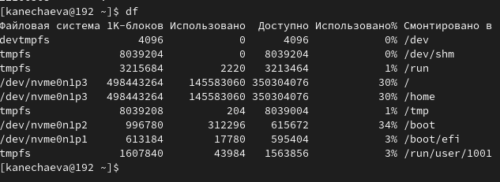

---
## Front matter
lang: ru-RU
title: Лабораторная работа №8
subtitle: Операционные системы
author:
  - Нечаева К.А.
institute:
  - Российский университет дружбы народов, Москва, Россия
date: 28 марта 2024

## i18n babel
babel-lang: russian
babel-otherlangs: english

## Formatting pdf
toc: false
toc-title: Содержание
slide_level: 2
aspectratio: 169
section-titles: true
theme: metropolis
header-includes:
 - \metroset{progressbar=frametitle,sectionpage=progressbar,numbering=fraction}
 - '\makeatletter'
 - '\beamer@ignorenonframefalse'
 - '\makeatother'
---

# Информация

## Докладчик

:::::::::::::: {.columns align=center}
::: {.column width="70%"}

  * Нечаева Кира Андреевна
  * Студентка
  * Российский университет дружбы народов
  * [1132236031@pfur.ru](mailto:1132236031@pfur.ru)
 

:::
::: {.column width="30%"}

:::
::::::::::::::

# Вводная часть

## Актуальность

- Важно уметь работать с командной строкой.
- Необходимо уметь использовать различные опции команд для оптимизации рабочего процесса.

## Объект и предмет исследования

- Терминал
- язык bash

## Цели и задачи

- Ознакомление с инструментами поиска файлов и фильтрации текстовых данных;
- Приобретение практических навыков по управлению процессами, по проверке использования диска и обслуживанию файловых систем.

## Материалы и методы

- Консоль (терминал) Linux

# Ход лабораторной работы

## Запись имен файлов в определенный файл

Сначала я записываю в файл file.txt названия файлов, содержащихся в каталоге /etc. и в моем домашнем каталоге.
Затем я вывожу имена всех файлов из file.txt, имеющих расширение .conf и записываю их в новый файл conf.txt.

## Нахождение файлов, содержащих определенный символ

Теперь мне нужно вывести, какие файлы в моем домашнем каталоге имеют имена, начинающиеся с символа c. 
Вывожу на экран имена файлов из каталога /etc, начинающиеся с символа h.

## Запуск процессов в фоновом режиме и их завершение

Теперь запускаю в фоновом режиме процесс записи в файл ~/logfile файлы, имена которых начинаются с log. 
Запускаю из консоли в фоновом режиме редактор gedit. 
После определяю идентификатор процесса gedit для того, чтобы с помощью команды kill и этого идентификатора завершить процесс.

## Команды df, du и find

Затем я выполняю команды df и du, предварительно получив более подробную информацию об этих командах, с помощью команды man. 
Воспользовавшись справкой команды find, я вывела имена всех директорий в домашнем каталоге

# Результаты 

При выполнении данной лабораторной работы я ознакомилась с инструментами поиска файлов и фильтрации текстовых данных и приобрела практические навыки по управлению процессами, проверке использования диска и обслуживанию файловых систем.

# Список литературы

1. [Электронный ресурс](https://esystem.rudn.ru/pluginfile.php/2288089/mod_resource/content/4/006-lab_proc.pdf)

