---
## Front matter
title: "Отчёт по лабораторной работе №8"
subtitle: "Дисциплина: Операционные системы"
author: "Нечаева Кира Андреевна"

## Generic otions
lang: ru-RU
toc-title: "Содержание"

## Bibliography
bibliography: bib/cite.bib
csl: pandoc/csl/gost-r-7-0-5-2008-numeric.csl

## Pdf output format
toc: true # Table of contents
toc-depth: 2
lof: true # List of figures
lot: true # List of tables
fontsize: 12pt
linestretch: 1.5
papersize: a4
documentclass: scrreprt
## I18n polyglossia
polyglossia-lang:
  name: russian
  options:
	- spelling=modern
	- babelshorthands=true
polyglossia-otherlangs:
  name: english
## I18n babel
babel-lang: russian
babel-otherlangs: english
## Fonts
mainfont: PT Serif
romanfont: PT Serif
sansfont: PT Sans
monofont: PT Mono
mainfontoptions: Ligatures=TeX
romanfontoptions: Ligatures=TeX
sansfontoptions: Ligatures=TeX,Scale=MatchLowercase
monofontoptions: Scale=MatchLowercase,Scale=0.9
## Biblatex
biblatex: true
biblio-style: "gost-numeric"
biblatexoptions:
  - parentracker=true
  - backend=biber
  - hyperref=auto
  - language=auto
  - autolang=other*
  - citestyle=gost-numeric
## Pandoc-crossref LaTeX customization
figureTitle: "Рис."
tableTitle: "Таблица"
listingTitle: "Листинг"
lofTitle: "Список иллюстраций"
lotTitle: "Список таблиц"
lolTitle: "Листинги"
## Misc options
indent: true
header-includes:
  - \usepackage{indentfirst}
  - \usepackage{float} # keep figures where there are in the text
  - \floatplacement{figure}{H} # keep figures where there are in the text
---

# Цель работы

Целью работы является ознакомление с инструментами поиска файлов и фильтрации текстовых данных, приобретение практических навыков: 
- по управлению процессами (и заданиями);
- по проверке использования диска и обслуживанию файловых систем.

# Задание
1. Запись имен файлов в определенный файл
2. Нахождение файлов, содержащих с определенный(-ые) символ(-ы) 
3. Запуск процессов в фоновом режиме и их завершение
4. Команды df, du и find

# Выполнение лабораторной работы

## Запись имен файлов в определенный файл
У меня изначально осуществлен вход в систему с именем моего пользователя.

Для начала записываю в файл file.txt названия файлов, содержащихся в каталоге /etc. (рис. [-@fig:001])

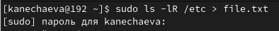{#fig:001 width=70%}

Теперь дописываю в этот же файл названия файлов, содержащихся в моем домашнем каталоге. (рис. [-@fig:002])

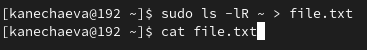{#fig:002 width=70%}

Затем я вывожу имена всех файлов из file.txt, имеющих расширение .conf. (рис. [-@fig:003])

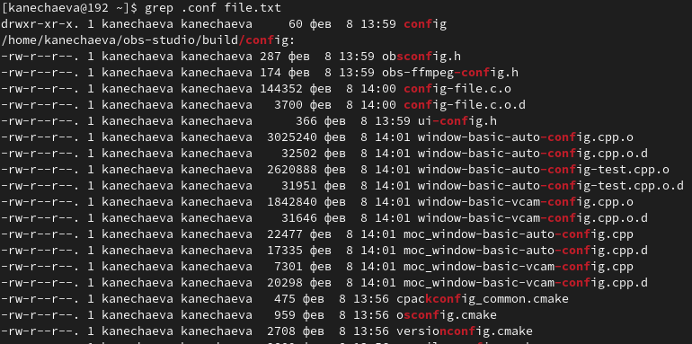{#fig:003 width=70%}

После чего записываю их в новый текстовой файл conf.txt и вывожу на экран доказательства изменений. (рис. [-@fig:004])

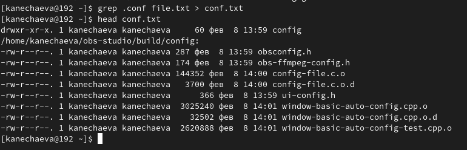{#fig:004 width=70%}

## Нахождение файлов, содержащих с определенный(-ые) символ(-ы) 

Теперь мне нужно определить, какие файлы в моем домашнем каталоге имеют имена, начинающиеся с символа c. (рис. [-@fig:005])

{#fig:005 width=70%}

Вывожу на экран (по странично) имена файлов из каталога /etc, начинающиеся с символа h. (рис. [-@fig:006])

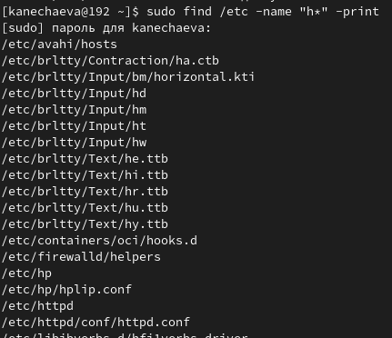{#fig:006 width=70%}

## Запуск процессов в фоновом режиме и их завершение

Теперь требуется запустить в фоновом режиме процесс, который будет записывать в файл ~/logfile файлы, имена которых начинаются с log. (рис. [-@fig:007])

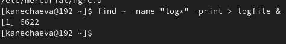{#fig:007 width=70%}

После чего удаляю файл ~/logfile. (рис. [-@fig:008])

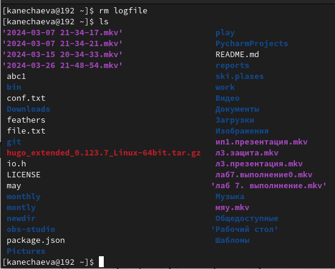{#fig:008 width=70%}

Запускаю из консоли в фоновом режиме редактор gedit. (рис. [-@fig:009])

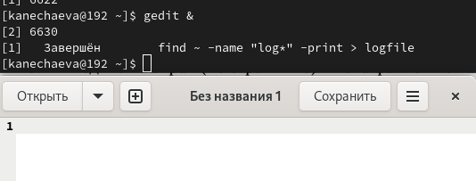{#fig:009 width=70%}

Теперь определяю идентификатор процесса gedit, используя команду ps, конвейер и фильтр grep. (рис. [-@fig:010])

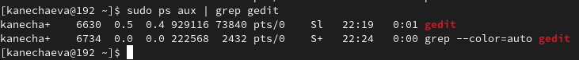{#fig:010 width=70%}

Читаю справку (man) команды kill, после чего использую её для завершения процесса gedit. Так после команды kill я ставлю идентификатор процесса gedit, чтобы его остановить. (рис. [-@fig:011])

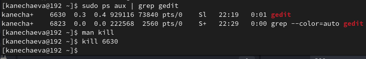{#fig:011 width=70%}

## Команды df, du и find

Затем я выполняю команды df и du, предварительно получив более подробную информацию об этих командах, с помощью команды man. (рис. [-@fig:012])

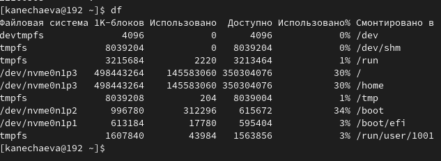{#fig:012 width=70%}

Воспользовавшись справкой команды find, я вывела имена всех директорий, имеющихся в вашем домашнем каталоге, однако в скриншот это не влезло.  (рис. [-@fig:012])

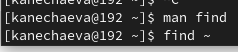{#fig:013 width=70%}

# Вывод

При выполнении данной лабораторной работы я ознакомилась с инструментами поиска файлов и фильтрации текстовых данных и приобрела практические навыки: 
- по управлению процессами;
- по проверке использования диска и обслуживанию файловых систем.

# Список литературы{.unnumbered}

1. [Электронный ресурс](https://esystem.rudn.ru/pluginfile.php/2288089/mod_resource/content/4/006-lab_proc.pdf)
