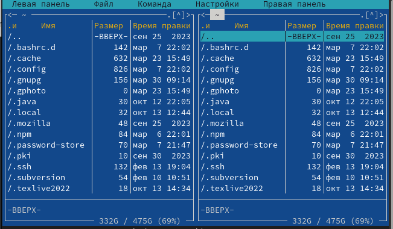
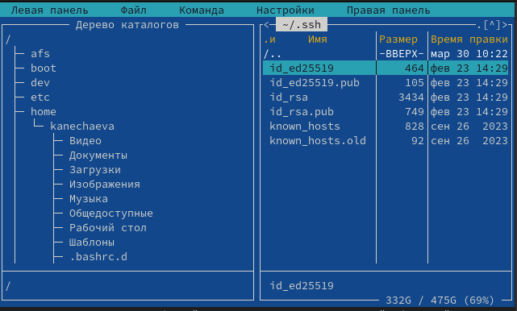
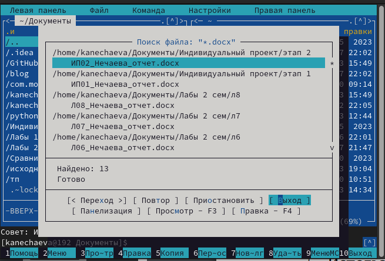
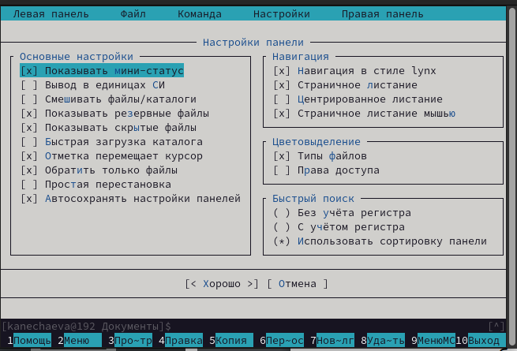
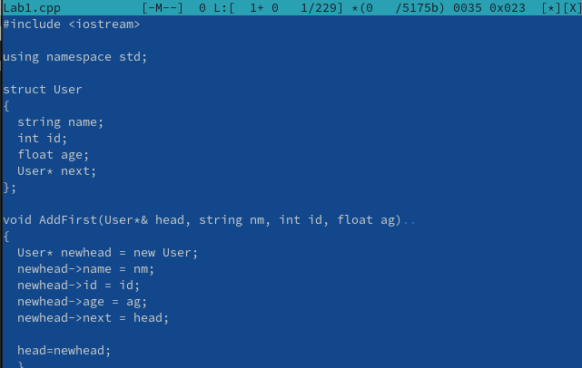

---
## Front matter
lang: ru-RU
title: Лабораторная работа №9
subtitle: Операционные системы
author:
  - Нечаева К.А.
institute:
  - Российский университет дружбы народов, Москва, Россия
date: 31 марта 2024

## i18n babel
babel-lang: russian
babel-otherlangs: english

## Formatting pdf
toc: false
toc-title: Содержание
slide_level: 2
aspectratio: 169
section-titles: true
theme: metropolis
header-includes:
 - \metroset{progressbar=frametitle,sectionpage=progressbar,numbering=fraction}
 - '\makeatletter'
 - '\beamer@ignorenonframefalse'
 - '\makeatother'
---

# Информация

## Докладчик

:::::::::::::: {.columns align=center}
::: {.column width="70%"}

  * Нечаева Кира Андреевна
  * Студентка
  * Российский университет дружбы народов
  * [1132236031@pfur.ru](mailto:1132236031@pfur.ru)
 

:::
::: {.column width="30%"}

:::
::::::::::::::

# Вводная часть

## Актуальность

- Важно уметь работать с Midnight Commander.
- Необходимо уметь использовать меню и горячие клавиши для оптимизации рабочего процесса.

## Объект и предмет исследования

- Терминал
- Midnight Commander

## Цели и задачи

- Освоение основных возможностей командной оболочки Midnight Commander; 
- Приобретение практических навыков работы по просмотру каталогов и файлов, манипуляций с ними.

## Материалы и методы

- Консоль (терминал) Linux
- Midnight Commander

# Ход лабораторной работы

## Задание по mc

Перед началом я изучила информацию о mc с помощью man, после запустила из командной строки mc, где начала изучать его структуру и меню.

## Меню панелей

С помощью комбинации клавиш Ctrl+x+c я могу посмотреть и поменять параметры прав доступа для файлов и каталогов. 
Затем с помощью меню панелей я выбираю для правой панели режим "Информация". 
После чего комбинацией клавиш Ctrl+u меняю правую и левую панели местами. 

## Меню файлов

Теперь используя возможности подменю "Файл", выполняю:

– просмотр содержимого текстового файла; 
– редактирование содержимого текстового файла;
– создание каталога; 
– копирование в файлов в созданный каталог.

## Меню команд

После с помощью соответствующих средств подменю "Команда" делаю:

– поиск в файловой системе файла с заданными условиями, а именно расширением .docx; 
– выбор и повторение одной из предыдущих команд;
– анализ файла меню и файла расширений.

## Меню настроек

Теперь я вызываю подменю "Настройки" и просматриваю какие операции можно с его помощью сделать.

## Задание по встроенному редактору mc

Вставляю в файл text.txt фрагмент текста, скопированный из Интернета. 
И теперь я:

 - удаляю строку текста с помощью Ctrl+y. 
 - выделяю фрагмент текста и перенесите его на новую строку.
 - выделяю фрагмент текста и копирую его на новую строку.
 - сохраняю файл на F2 и отменяю последнее действие.
 - перемещаюсь в конец файла и пишу текст. 
 - перемещаюсь в начало файла и пишу текст. 
 - наконец сохраняю файл на F2 и закрываю его на F10. 

## Подсветка синтаксиса

Теперь открываю файл с исходным текстом на С++ и выключаю подсветку синтаксиса.

# Результаты 

При выполнении данной лабораторной работы я освоила основне возможности командной оболочки Midnight Commander, приобретела практические навыки работы по просмотру каталогов и файлов, манипуляций с ними.

# Список литературы

1. [Электронный ресурс](https://esystem.rudn.ru/pluginfile.php/2288091/mod_resource/content/5/007-lab_mc.pdf)

