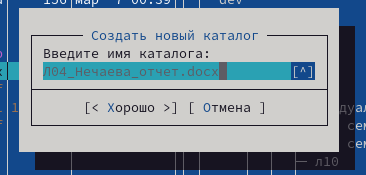

---
## Front matter
title: "Отчёт по лабораторной работе №9"
subtitle: "Дисциплина: Операционные системы"
author: "Нечаева Кира Андреевна"

## Generic otions
lang: ru-RU
toc-title: "Содержание"

## Bibliography
bibliography: bib/cite.bib
csl: pandoc/csl/gost-r-7-0-5-2008-numeric.csl

## Pdf output format
toc: true # Table of contents
toc-depth: 2
lof: true # List of figures
lot: true # List of tables
fontsize: 12pt
linestretch: 1.5
papersize: a4
documentclass: scrreprt
## I18n polyglossia
polyglossia-lang:
  name: russian
  options:
	- spelling=modern
	- babelshorthands=true
polyglossia-otherlangs:
  name: english
## I18n babel
babel-lang: russian
babel-otherlangs: english
## Fonts
mainfont: PT Serif
romanfont: PT Serif
sansfont: PT Sans
monofont: PT Mono
mainfontoptions: Ligatures=TeX
romanfontoptions: Ligatures=TeX
sansfontoptions: Ligatures=TeX,Scale=MatchLowercase
monofontoptions: Scale=MatchLowercase,Scale=0.9
## Biblatex
biblatex: true
biblio-style: "gost-numeric"
biblatexoptions:
  - parentracker=true
  - backend=biber
  - hyperref=auto
  - language=auto
  - autolang=other*
  - citestyle=gost-numeric
## Pandoc-crossref LaTeX customization
figureTitle: "Рис."
tableTitle: "Таблица"
listingTitle: "Листинг"
lofTitle: "Список иллюстраций"
lotTitle: "Список таблиц"
lolTitle: "Листинги"
## Misc options
indent: true
header-includes:
  - \usepackage{indentfirst}
  - \usepackage{float} # keep figures where there are in the text
  - \floatplacement{figure}{H} # keep figures where there are in the text
---

# Цель работы

Целью работы является освоение основных возможностей командной оболочки Midnight Commander, приобретение практических навыков работы по просмотру каталогов и файлов, манипуляций с ними.

# Задание

1. Задание по mc
    1.1. Меню панелей
    1.2. Меню файлов
    1.3. Меню команд
    1.4 Меню настроек
2. Задание по встроенному редактору mc

# Выполнение лабораторной работы

## Задание по mc

Перед началом работы я изучу информацию о mc, вызвав в командной строке man mc. (рис. [-@fig:001])

{#fig:001 width=70%}

Теперь запускаю из командной строки mc, изучаю его структуру и меню. (рис. [-@fig:002])

{#fig:002 width=70%}

### Меню панелей

Мне нужно выполнить несколько операций в mc, используя управляющие клавиши и выполнить основные команды меню панелей. 

С помощью комбинации клавиш Ctrl+x+c я могу посмотреть и поменять параметры прав доступа для файлов и каталогов. (рис. [-@fig:003])

{#fig:003 width=70%}

Затем с помощью меню панелей я выбираю для правой панели режим "Информация". (рис. [-@fig:004])

{#fig:004 width=70%}

После чего комбинацией клавиш Ctrl+u меняю правую и левую панели местами. (рис. [-@fig:005])

{#fig:005 width=70%}

### Меню файлов

Теперь используя возможности подменю "Файл", выполняю:

– просмотр содержимого текстового файла; (рис. [-@fig:006])

{#fig:006 width=70%}

– редактирование содержимого текстового файла (без сохранения результатов редактирования); (рис. [-@fig:007])

{#fig:007 width=70%}

– создание каталога; (рис. [-@fig:008])

{#fig:008 width=70%}

– копирование в файлов в созданный каталог. (рис. [-@fig:009])

{#fig:009 width=70%}

### Меню команд

После с помощью соответствующих средств подменю "Команда" делаю:

– поиск в файловой системе файла с заданными условиями, а именно расширением .docx; (рис. [-@fig:010]), (рис. [-@fig:011])

{#fig:010 width=70%}

{#fig:011 width=70%}

– выбор и повторение одной из предыдущих команд; (рис. [-@fig:012])

{#fig:012 width=70%}

– переход в домашний каталог из "Каталогов быстрого доступа"; (рис. [-@fig:013])

{#fig:013 width=70%}

– анализ файла меню и файла расширений. (рис. [-@fig:014])

{#fig:014 width=70%}

### Меню настроек

Теперь я вызываю подменю "Настройки" и просматриваю какие операции можжно с его помощью сделать. (рис. [-@fig:015]), (рис. [-@fig:016])

{#fig:015 width=70%}

{#fig:016 width=70%}

## Задание по встроенному редактору mc

Для начала я создаю текстовой файл text.txt и открываю его с помощью встроенного в mc редактора. (рис. [-@fig:016])

{#fig:017 width=70%}

Вставляю в уже открытый файл небольшой фрагмент текста, скопированный мной из Интернета. (рис. [-@fig:018])

{#fig:018 width=70%}

И теперь я проделаю с текстом следующие манипуляции, используя горячие клавиши:

 - удаляю строку текста с помощью Ctrl+y. (рис. [-@fig:019])

{#fig:019 width=70%}

 - выделяю фрагмент текста и перенесите его на новую строку. Перенести фрагмент можно с помощью клавиши F6. (рис. [-@fig:020])

{#fig:020 width=70%}

 - выделяю фрагмент текста и копирую его на новую строку. С помощью клавиши F3 я начинаю и заканчиваю выделение текста, а с помощью F5 копирую на следующую строку. (рис. [-@fig:021])

{#fig:021 width=70%}

 - сохраняю файл на F2 и отменяю последнее действие с помощью Ctrl+u, соответственно изменения не сохраняются. (рис. [-@fig:022])

{#fig:022 width=70%}

 - перемещаюсь в конец файла с помощью комбинации Ctrl+End и пишу текст. (рис. [-@fig:023])

{#fig:023 width=70%}

 - перемещаюсь в начало файла с помощью комбинации Ctrl+Home и пишу текст. (рис. [-@fig:024])

{#fig:024 width=70%}

 - наконец сохраняю файл на F2 и закрываю его на F10. (рис. [-@fig:025])

{#fig:025 width=70%}

Теперь открываю файл с исходным текстом на С++. (рис. [-@fig:026])

{#fig:026 width=70%}

У меня включена подсветка синтаксиса, так что чтобы её выключить я нажимаю комбинацию клавиш Сtrl+S. (рис. [-@fig:027])

{#fig:027 width=70%}

# Вывод

При выполнении данной лабораторной работы я освоила основне возможности командной оболочки Midnight Commander, приобретела практические навыки работы по просмотру каталогов и файлов, манипуляций с ними.

# Список литературы{.unnumbered}

1. [Электронный ресурс](https://esystem.rudn.ru/pluginfile.php/2288091/mod_resource/content/5/007-lab_mc.pdf)
