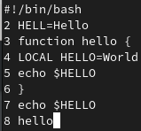
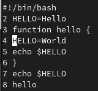
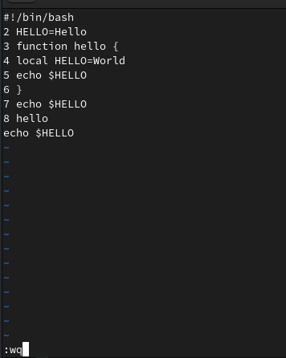

---
## Front matter
lang: ru-RU
title: Лабораторная работа №10
subtitle: Операционные системы
author:
  - Нечаева К.А.
institute:
  - Российский университет дружбы народов, Москва, Россия
date: 13 апреля 2024

## i18n babel
babel-lang: russian
babel-otherlangs: english

## Formatting pdf
toc: false
toc-title: Содержание
slide_level: 2
aspectratio: 169
section-titles: true
theme: metropolis
header-includes:
 - \metroset{progressbar=frametitle,sectionpage=progressbar,numbering=fraction}
 - '\makeatletter'
 - '\beamer@ignorenonframefalse'
 - '\makeatother'
---

# Информация

## Докладчик

:::::::::::::: {.columns align=center}
::: {.column width="70%"}

  * Нечаева Кира Андреевна
  * Студентка
  * Российский университет дружбы народов
  * [1132236031@pfur.ru](mailto:1132236031@pfur.ru)
 

:::
::: {.column width="30%"}

:::
::::::::::::::

# Вводная часть

## Актуальность

- Важно уметь работать с текстовым редактором vi.
- Необходимо уметь использовать горячие клавиши для оптимизации рабочего процесса.

## Объект и предмет исследования

- Терминал
- vi

## Цели и задачи

- Знакомство с операционной системой Linux; 
- Получение практических навыков работы с редактором vi, установленным по умолчанию практически во всех дистрибутивах.

## Материалы и методы

- Консоль (терминал) Linux
- vi

# Ход лабораторной работы

## Создание нового файла с использованием vi

Создаю каталог с именем ~/work/os/lab06 и перехожу в него. После чего вызываю vi и создаю файл hello.sh. 

Теперь нажимаю клавишу i и ввожу текст. После завершения воода текста нажимаю Esc для перехода в командный режим. 

Для перехода в режим последней строки нажимаю : и пишу w для записи изменений и q для выхода. Делаю файл исполняемым. 

## Редактирование существующего файла

Вызываю vi на редактирование файла. 

Устанавливаю курсор в конец слова HELL второй строки. Теперь перехожу в режим вставки и заменяю на HELLO. 

Теперь устанавливаю курсор на четвертую строку и стираю слово LOCAL.

Перехожу в режим вставки и набираю local. 

## Редактирование существующего файла 2 часть

Устонавливаю курсор на последней строке файла. Вставляю после неё строку echo $HELLO, а после удаляю. 

Ввожу команду отмены изменений u для отмены последней команды. 

Набираю в режиме последней строки :wq и выхожу из vi.

# Результаты

При выполнении данной лабораторной работы я познакомилась с операционной системой Linux и получила практические навыки работы с редактором vi, установленным по умолчанию практически во всех дистрибутивах.

# Список литературы

1. [Электронный ресурс](https://esystem.rudn.ru/pluginfile.php/2288093/mod_resource/content/4/008-lab_vi.pdf)
