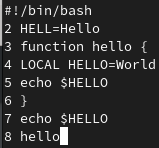

---
## Front matter
title: "Отчёт по лабораторной работе №10"
subtitle: "Дисциплина: Операционные системы"
author: "Нечаева Кира Андреевна"

## Generic otions
lang: ru-RU
toc-title: "Содержание"

## Bibliography
bibliography: bib/cite.bib
csl: pandoc/csl/gost-r-7-0-5-2008-numeric.csl

## Pdf output format
toc: true # Table of contents
toc-depth: 2
lof: true # List of figures
lot: true # List of tables
fontsize: 12pt
linestretch: 1.5
papersize: a4
documentclass: scrreprt
## I18n polyglossia
polyglossia-lang:
  name: russian
  options:
	- spelling=modern
	- babelshorthands=true
polyglossia-otherlangs:
  name: english
## I18n babel
babel-lang: russian
babel-otherlangs: english
## Fonts
mainfont: PT Serif
romanfont: PT Serif
sansfont: PT Sans
monofont: PT Mono
mainfontoptions: Ligatures=TeX
romanfontoptions: Ligatures=TeX
sansfontoptions: Ligatures=TeX,Scale=MatchLowercase
monofontoptions: Scale=MatchLowercase,Scale=0.9
## Biblatex
biblatex: true
biblio-style: "gost-numeric"
biblatexoptions:
  - parentracker=true
  - backend=biber
  - hyperref=auto
  - language=auto
  - autolang=other*
  - citestyle=gost-numeric
## Pandoc-crossref LaTeX customization
figureTitle: "Рис."
tableTitle: "Таблица"
listingTitle: "Листинг"
lofTitle: "Список иллюстраций"
lotTitle: "Список таблиц"
lolTitle: "Листинги"
## Misc options
indent: true
header-includes:
  - \usepackage{indentfirst}
  - \usepackage{float} # keep figures where there are in the text
  - \floatplacement{figure}{H} # keep figures where there are in the text
---

# Цель работы

Целью работы является знакомство с операционной системой Linux и получение практических навыков работы с редактором vi, установленным по умолчанию практически во всех дистрибутивах.

# Задание

1. Создание нового файла с использованием vi
2. Редактирование существующего файла

# Выполнение лабораторной работы

## Создание нового файла с использованием vi

Для начала я создаю каталог с именем ~/work/os/lab06 и перехожу в него. После чего вызываю vi и создаю файл hello.sh. (рис. [-@fig:001])

{#fig:001 width=70%}

Теперь нажимаю клавишу i и ввожу следующий текст. После завершения воода текста нажимаю Esc для перехода в командный режим. (рис. [-@fig:002])

{#fig:002 width=70%}

Для перехода в режим последней строки нажимаю : и пишу w для записи изменений и q для выхода. Затем нажимаю клавишу Enter для завершения работы. (рис. [-@fig:003])

{#fig:003 width=70%}

Сделаю файл исполняемым. (рис. [-@fig:004])

{#fig:004 width=70%}

## Редактирование существующего файла

Вызываю vi на редактирование файла. (рис. [-@fig:005])

{#fig:005 width=70%}

Устанавливаю курсор в конец слова HELL второй строки. На вторую команду я перехожу с помощью сочетания клавиш 2G. Теперь перехожу в режим вставки и заменяю на HELLO, нажимаю Esc для возврата в командный режим. (рис. [-@fig:006])

{#fig:006 width=70%}

Теперь устанавливаю курсор на четвертую строку и стираю слово LOCAL клавишами dw. (рис. [-@fig:007])

{#fig:007 width=70%}

Перехожу в режим вставки с помощью i и набираю local, нажимаю Esc для возврата в командный режим. (рис. [-@fig:008])

{#fig:008 width=70%}

Устонавливаю курсор на последней строке файла с помощью G. Вставляю после неё строку echo $HELLO. (рис. [-@fig:009])

{#fig:009 width=70%}

Удаляю последнюю строку с помощью dd. (рис. [-@fig:010])

{#fig:010 width=70%}

Ввожу команду отмены изменений u для отмены последней команды. (рис. [-@fig:011])

{#fig:011 width=70%}

Введожу символ : для перехода в режим последней строки и записываю произведённые изменения, после выхожу из vi. (рис. [-@fig:012])

{#fig:012 width=70%}

# Вывод

При выполнении данной лабораторной работы я познакомилась с операционной системой Linux и получила практические навыки работы с редактором vi, установленным по умолчанию практически во всех дистрибутивах.

# Список литературы{.unnumbered}

1. [Электронный ресурс](https://esystem.rudn.ru/pluginfile.php/2288093/mod_resource/content/4/008-lab_vi.pdf)
