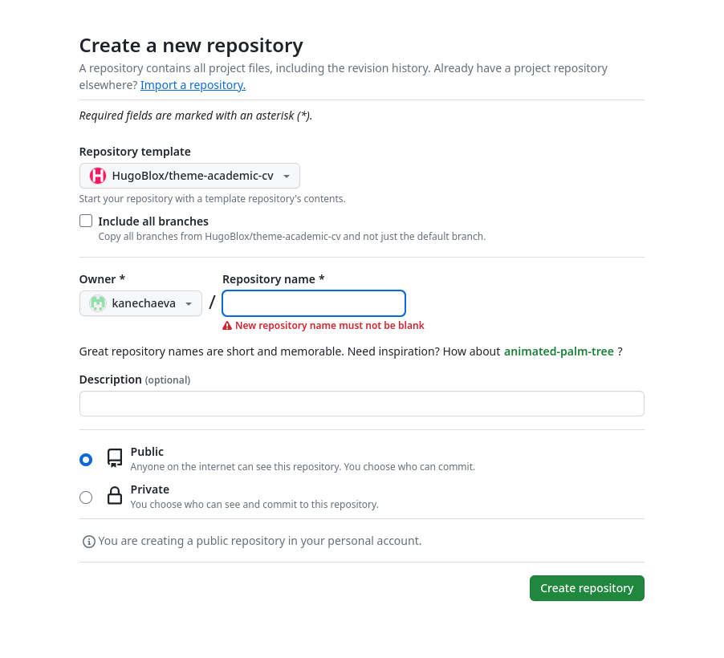

---
## Front matter
title: "Отчёт по первому этапу индивидуального проекта"
subtitle: "Дисциплина: Операционные сиситемы"
author: "Нечаева Кира Андреевна"

## Generic otions
lang: ru-RU
toc-title: "Содержание"

## Bibliography
bibliography: bib/cite.bib
csl: pandoc/csl/gost-r-7-0-5-2008-numeric.csl

## Pdf output format
toc: true # Table of contents
toc-depth: 2
lof: true # List of figures
lot: true # List of tables
fontsize: 12pt
linestretch: 1.5
papersize: a4
documentclass: scrreprt
## I18n polyglossia
polyglossia-lang:
  name: russian
  options:
	- spelling=modern
	- babelshorthands=true
polyglossia-otherlangs:
  name: english
## I18n babel
babel-lang: russian
babel-otherlangs: english
## Fonts
mainfont: PT Serif
romanfont: PT Serif
sansfont: PT Sans
monofont: PT Mono
mainfontoptions: Ligatures=TeX
romanfontoptions: Ligatures=TeX
sansfontoptions: Ligatures=TeX,Scale=MatchLowercase
monofontoptions: Scale=MatchLowercase,Scale=0.9
## Biblatex
biblatex: true
biblio-style: "gost-numeric"
biblatexoptions:
  - parentracker=true
  - backend=biber
  - hyperref=auto
  - language=auto
  - autolang=other*
  - citestyle=gost-numeric
## Pandoc-crossref LaTeX customization
figureTitle: "Рис."
tableTitle: "Таблица"
listingTitle: "Листинг"
lofTitle: "Список иллюстраций"
lotTitle: "Список таблиц"
lolTitle: "Листинги"
## Misc options
indent: true
header-includes:
  - \usepackage{indentfirst}
  - \usepackage{float} # keep figures where there are in the text
  - \floatplacement{figure}{H} # keep figures where there are in the text
---

# **Цель работы**

Целью работы является создание основных элементов для сайта на hugo.

# **Задание**
    1. Установка необходимого ПО
    2. Структура сайта
    3. Настройка сайта
    4. Публикация сайта

# **Выолнение проекта**

## **Установка необходимого ПО**

Для начала я устанавливаю go, так как на нем написан hugo, и, соответственно, без go ничего работать не будет. (рис. [-@fig:001])

{#fig:001 width=70%}

После этого я скачала с официального репозитория hugo архив с последней версией Hugo Extended. (рис. [-@fig:002])

{#fig:002 width=70%}

Затем я его установила в терминале (рис. [-@fig:003]). После чего разархивировала и удалила лишние файлы. (рис. [-@fig:004]) 

{#fig:003 width=70%}

{#fig:004 width=70%}

## **Структура сайта**

Теперь я захожу на репозиторий hugo, откуда я возьму шаблон для своего репозитория сайта. (рис. [-@fig:005])

{#fig:005 width=70%}

Там же я создаю свой репозиторий, нажав на кнопку "Use this template". (рис. [-@fig:006]), (рис. [-@fig:007])

{#fig:006 width=70%}

{#fig:007 width=70%}

Теперь я клонирую репозиторий к себе на компьютер. (рис. [-@fig:008])

{#fig:008 width=70%}

## **Настройка сайта**

Затем на Github я создаю новый репозиторий, где также будет храниться работа по моему сайту. (рис. [-@fig:009])

{#fig:009 width=70%}

Теперь я клонирую его.(рис. [-@fig:010])

{#fig:010 width=70%}

После этого я добавляю главную ветку и создаю файл, чтобы мне было удобнее копировать ссылку для следующего шага. (рис. [-@fig:011])

{#fig:011 width=70%}

И сейчас мне нужно сделать репозиторий kanechaeva.github.io подмодулем public в папке блога. (рис. [-@fig:012])

{#fig:012 width=70%}

## **Публикация сайта**

После этого с помощью команды hugo я фиксирую изменения на сайте. (рис. [-@fig:013])

{#fig:013 width=70%}

Теперь проверяю корректность выполненных действий. (рис. [-@fig:014])

{#fig:014 width=70%}

И наконец отправляю все изменение на Github.(рис. [-@fig:015])

{#fig:015 width=70%}

# **Вывод**

При выполнении данного этапа проекта я создала основныe элементы для сайта на hugo.

# **Список литературы{.unnumbered}**

::: [Инструкция от Д.С. Кулябова](https://yamadharma.github.io/ru/post/2022/04/12/creating-hugo-site/)

[Официальный сайт hugo](https://github.com/gohugoio/hugo/releases)
:::
