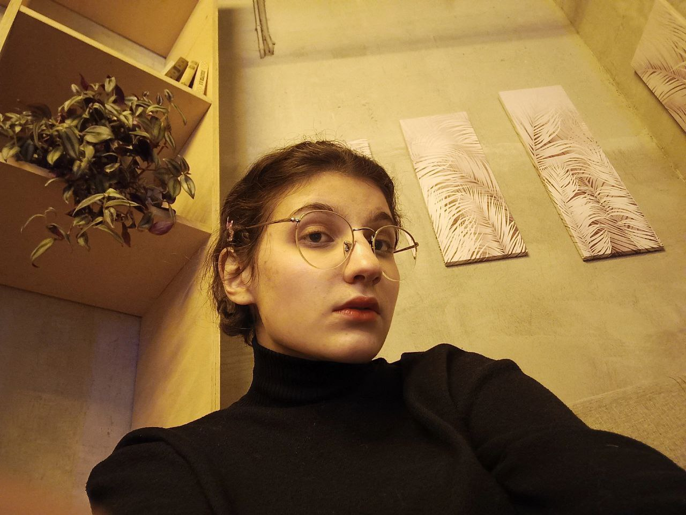
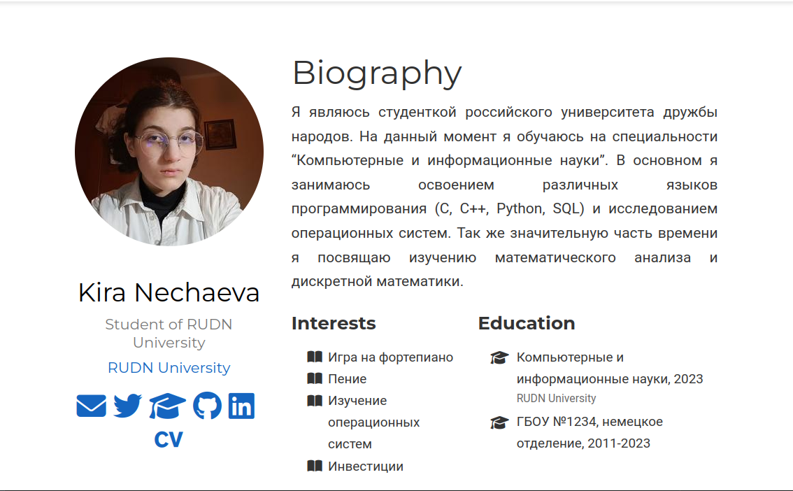
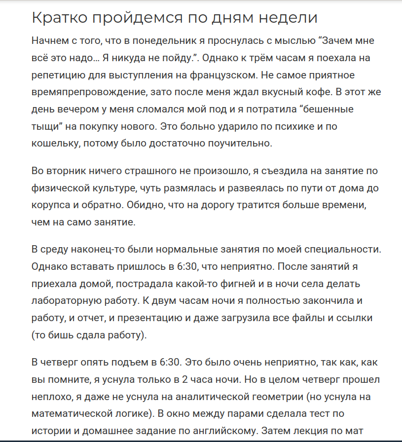
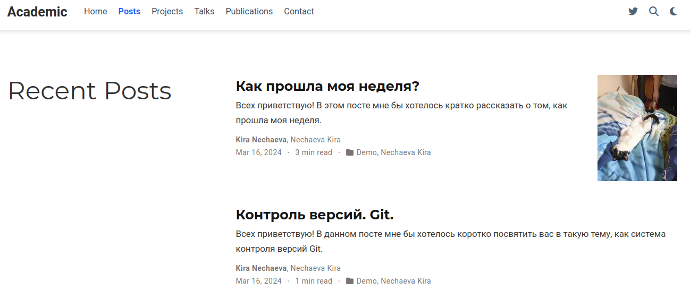

---
## Front matter
lang: ru-RU
title: Второй этап индивидуального проекта
subtitle: Операционные системы
author:
  - Нечаева К.А.
institute:
  - Российский университет дружбы народов, Москва, Россия
date: 16 марта 2024

## i18n babel
babel-lang: russian
babel-otherlangs: english

## Formatting pdf
toc: false
toc-title: Содержание
slide_level: 2
aspectratio: 169
section-titles: true
theme: metropolis
header-includes:
 - \metroset{progressbar=frametitle,sectionpage=progressbar,numbering=fraction}
 - '\makeatletter'
 - '\beamer@ignorenonframefalse'
 - '\makeatother'
---

# Информация

## Докладчик

:::::::::::::: {.columns align=center}
::: {.column width="70%"}

  * Нечаева Кира Андреевна
  * Студентка
  * Российский университет дружбы народов
  * [1132236031@pfur.ru](mailto:1132236031@pfur.ru)
 

:::
::: {.column width="30%"}

:::
::::::::::::::

# Вводная часть

## Актуальность

- Научному работнику полезно иметь сайт-портфолио про него и его проекты.

## Объект и предмет исследования

- hugo
- Git
- Моя жизнь

## Цели и задачи

- Целью работы является добавить основную информацию о себе и сделать публикации на сайт на основе hugo.

# **Выолнение проекта**

## Добавление основной информации о себе

Для начала я размещаю свое фото. После этого я меняю везде имя на своё. Теперь я добавляю свои интересы и информацию о своем образовании.  В конце я добавляю биографию, а точнее небольшое описание, и вот как теперь выглядит мой сайт. 

## Пост по прошедшей неделе

Для того, чтобы начать работа над постом по прошедшей неделе я перехожу из blog в подкаталог content и оттуда в каталог post. Там я создаю каталог last-week. Теперь я просто пишу свой пост по шаблону (рекомендациям) от Дмитрия Сергеевича Кулябова. Вот так выглядит мой пост на сайте.

## Пост на тему "Управление версиями Git"

Теперь так же в каталоге post я создаю подкаталог Git. Теперь точно так же начинаю писать пост. И вот как сейчас в общем выглядят мои посты на сайте. 

# Результаты

При выполнении данного этапа проекта я добавила основную информацию о себе и сделала публикации на сайт на основе hugo.

# **Список литературы{.unnumbered}**

::: [Инструкция от Д.С. Кулябова](https://yamadharma.github.io/ru/post/2022/05/05/template-post-last-week/)

[Инструкция с сайта РУДН](https://esystem.rudn.ru/mod/page/view.php?id=1098777)
:::
