---
## Front matter
title: "Отчёт по второму этапу индивидуального проекта"
subtitle: "Дисциплина: Операционные сиситемы"
author: "Нечаева Кира Андреевна"

## Generic otions
lang: ru-RU
toc-title: "Содержание"

## Bibliography
bibliography: bib/cite.bib
csl: pandoc/csl/gost-r-7-0-5-2008-numeric.csl

## Pdf output format
toc: true # Table of contents
toc-depth: 2
lof: true # List of figures
lot: true # List of tables
fontsize: 12pt
linestretch: 1.5
papersize: a4
documentclass: scrreprt
## I18n polyglossia
polyglossia-lang:
  name: russian
  options:
	- spelling=modern
	- babelshorthands=true
polyglossia-otherlangs:
  name: english
## I18n babel
babel-lang: russian
babel-otherlangs: english
## Fonts
mainfont: PT Serif
romanfont: PT Serif
sansfont: PT Sans
monofont: PT Mono
mainfontoptions: Ligatures=TeX
romanfontoptions: Ligatures=TeX
sansfontoptions: Ligatures=TeX,Scale=MatchLowercase
monofontoptions: Scale=MatchLowercase,Scale=0.9
## Biblatex
biblatex: true
biblio-style: "gost-numeric"
biblatexoptions:
  - parentracker=true
  - backend=biber
  - hyperref=auto
  - language=auto
  - autolang=other*
  - citestyle=gost-numeric
## Pandoc-crossref LaTeX customization
figureTitle: "Рис."
tableTitle: "Таблица"
listingTitle: "Листинг"
lofTitle: "Список иллюстраций"
lotTitle: "Список таблиц"
lolTitle: "Листинги"
## Misc options
indent: true
header-includes:
  - \usepackage{indentfirst}
  - \usepackage{float} # keep figures where there are in the text
  - \floatplacement{figure}{H} # keep figures where there are in the text
---

# **Цель работы**

Целью работы является добавить основную информацию о себе и сделать публикации на сайт на основе hugo.

# **Задание**
    1. Добавление основной информации о себе
    2. Пост по прошедшей неделе
    3. Пост на тему "Управление версиями Git"

# **Выолнение проекта**

## Добавление основной информации о себе

Для начала я помещаю свое фото в каталог "blog", а точнее в один из его подкаталогов. Все действия, описанные в этом разделе далее, будут выполняться в файле рядом с фото. (рис. [-@fig:001])

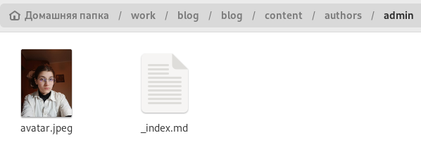{#fig:001 width=70%}

После этого я меняю везде меняю имя на своё. (рис. [-@fig:002])

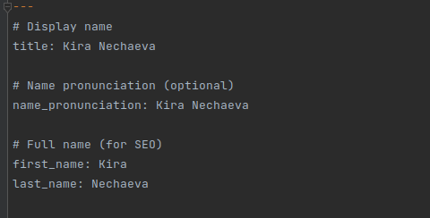{#fig:002 width=70%}

Затем я добавляю информацию о том, в каком университете я обучаюсь, и размещаю ссылку на сайт университета. Так же пишу краткое описание, которое будет высвечиваться под всеми постами. (рис. [-@fig:003]) 

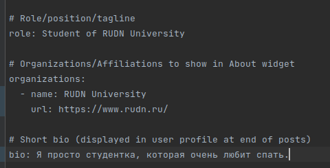{#fig:003 width=70%}

Теперь я размещаю свои интересы и информацию о своем образовании. (рис. [-@fig:004])

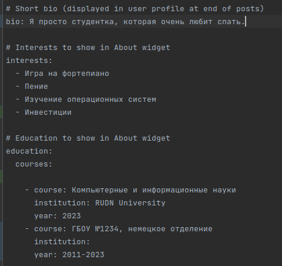{#fig:004 width=70%}

Далее я на всякий случай немного меняю раздел Skills под себя. (рис. [-@fig:005])

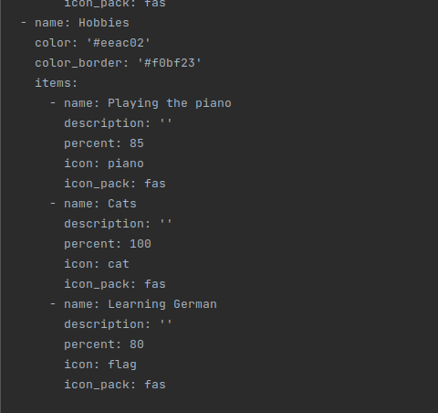{#fig:005 width=70%}

Затем я добавляю биографию, а точнее небольшое описание, и вот как теперь выглядит мой сайт. (рис. [-@fig:006])

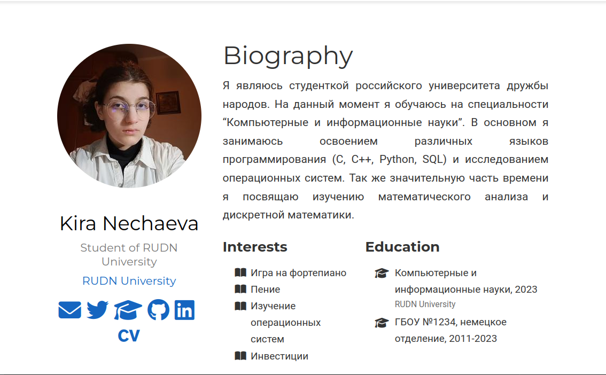{#fig:006 width=70%}

## Пост по прошедшей неделе

Для того, чтобы начать работа над постом по прошедшей неделе я перехожу в каталог blog, затем в подкаталог content и оттуда в каталог post. Там я создаю каталог last-week. В нём и будем работать. (рис. [-@fig:007])

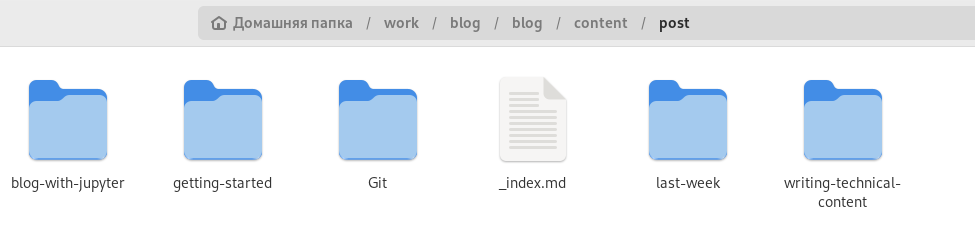{#fig:007 width=70%}

Теперь я просто пишу свой пост по шаблону (рекомендациям) от Дмитрия Сергеевича Кулябова. (рис. [-@fig:008])

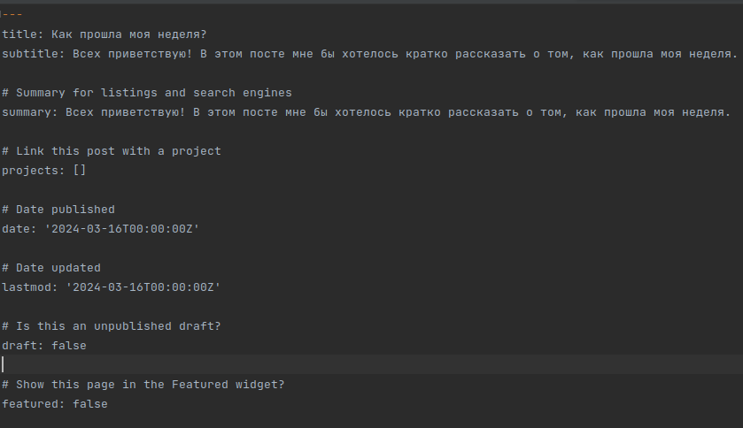{#fig:008 width=70%}

Вот так выглядит мой пост на сайте (рис. [-@fig:009])

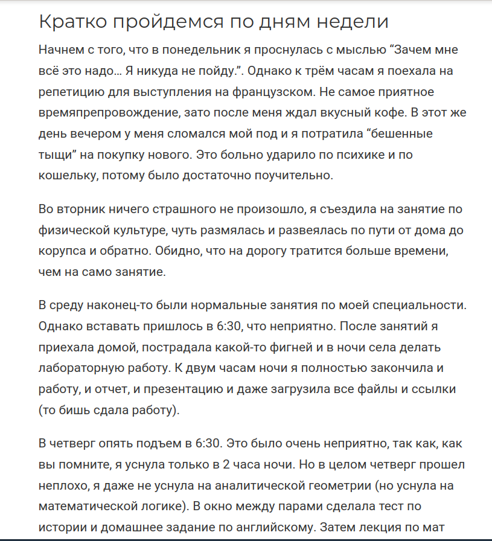{#fig:009 width=70%}

## Пост на тему "Управление версиями Git"

Теперь так же в каталоге post я создаю подкаталог Git. Он был у меня показан на рисунке 7.  Теперь точно так же начинаю писать пост. (рис. [-@fig:010])

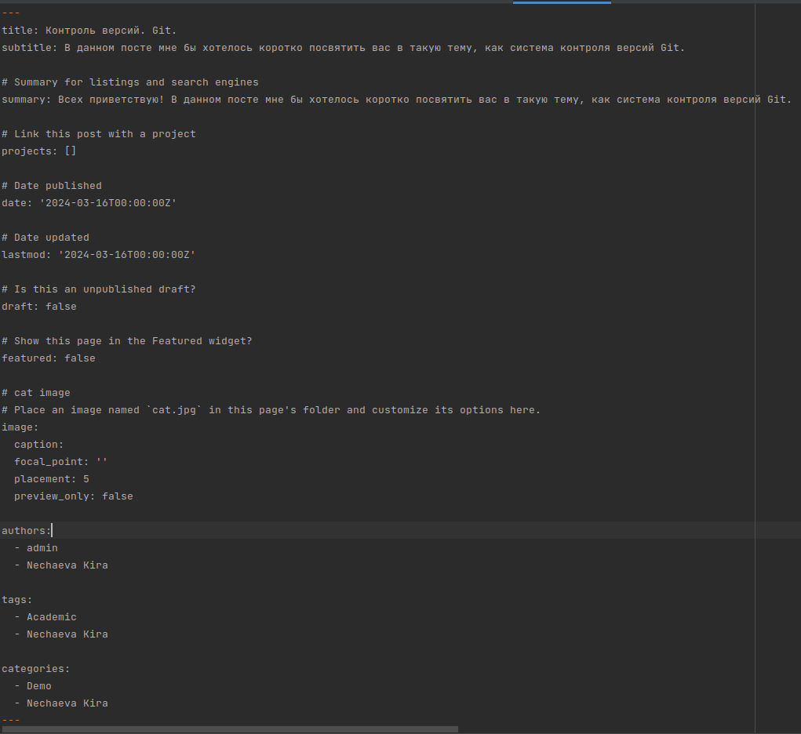{#fig:010 width=70%}

Вот как выглядит этот пост на сайте. (рис. [-@fig:011])

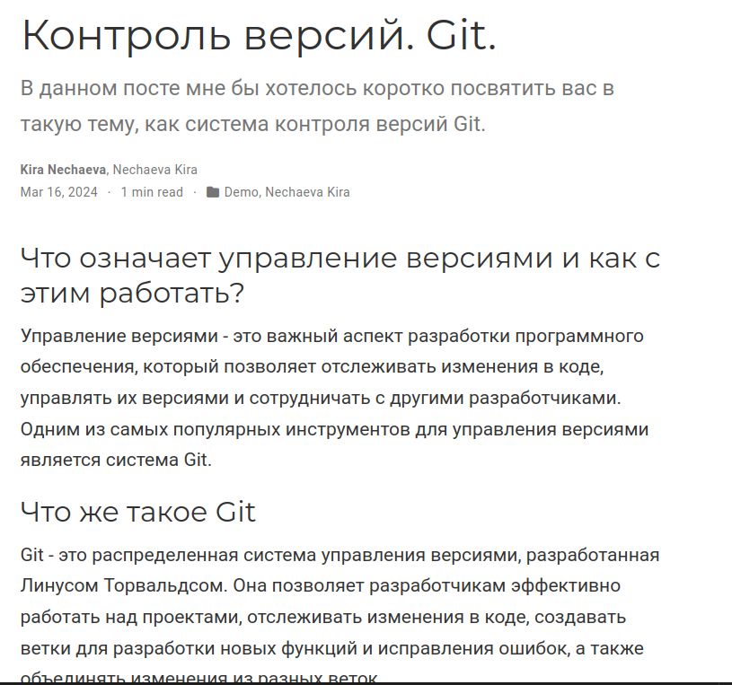{#fig:011 width=70%}

И вот как сейчас в общем выглядят мои посты на сайте (рис. [-@fig:012])

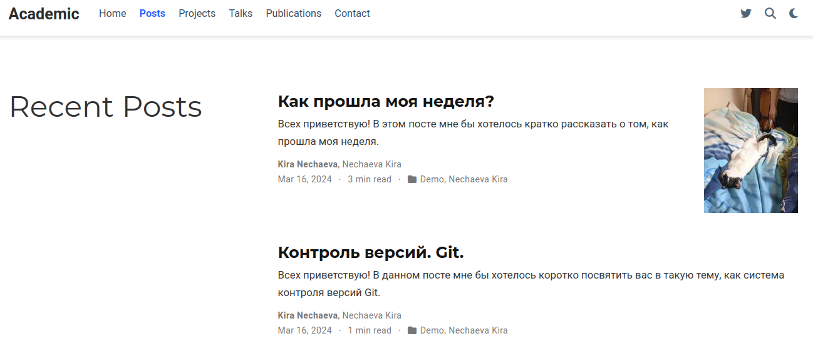{#fig:012 width=70%}

# **Вывод**

При выполнении данного этапа проекта я добавила основную информацию о себе и сделала публикации на сайт на основе hugo.

# **Список литературы{.unnumbered}**

::: [Инструкция от Д.С. Кулябова](https://yamadharma.github.io/ru/post/2022/05/05/template-post-last-week/)

[Инструкция с сайта РУДН](https://esystem.rudn.ru/mod/page/view.php?id=1098777)
:::
